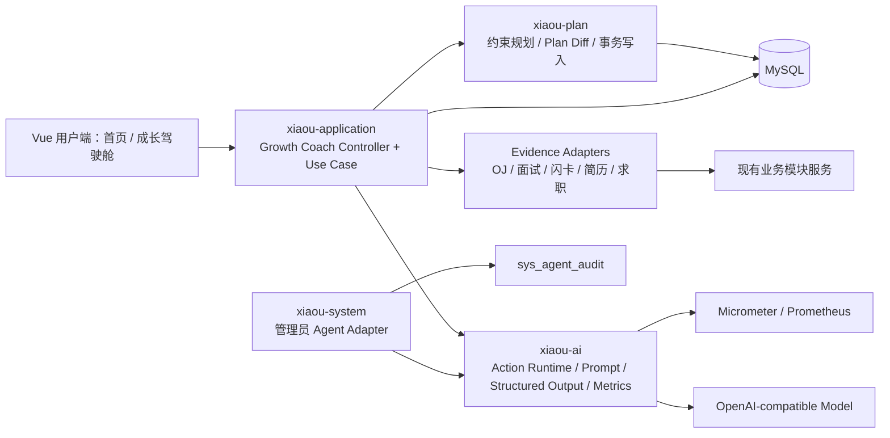
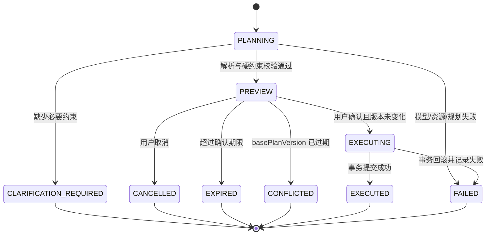
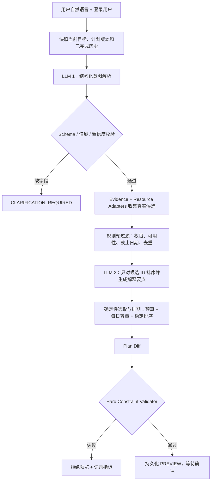

# Code Nest v2.5.0：AI Growth Coach 技术架构与技术选型

> 状态：实施中（P0 核心纵切面已落地）
>
> 技术基线：`master@0e1e8750e8eb`（v2.4.3）
>
> 编写日期：2026-07-17
>
> 目标读者：技术负责人、后端、前端、测试、运维
>
> 配套产品文档：[AI 成长教练调研与落地方案](../PRD/AI成长教练调研与落地方案-v2.5.0.md)

## 0. 当前实施状态（2026-07-20）

v2.5.0 的 P0 已从方案进入可验证实现，核心用户闭环已覆盖“自然语言调整计划、用户确认、版本化执行、今日行动、成长证据引用”。当前可按下表判断完成度，而不是以聊天轮数或模型调用次数衡量。

| 能力 | 状态 | 已实现范围 | 尚未纳入本批次 |
| --- | --- | --- | --- |
| 自然语言计划调整 | 已完成 | `Preview -> Confirm -> 审计 -> 版本化写入`，LLM 仅解析结构化意图，规则规划器执行硬约束 | 多周调整、开放式聊天 |
| 今日最优行动 | 已完成 | 首页只展示一个可开始动作，含时长、选择原因、完成后的预期变化 | 多动作推荐流 |
| 统一教练焦点 | 已完成 | `GET /user/growth-coach/briefing` 从复盘、投递、求职闭环、岗位差距、弱项、JD 样本和今日任务中确定性选择一项优先动作 | 开放式聊天、自动执行 |
| 成长证据索引 | 已完成最小闭环 | `growth_evidence`、按用户/来源游标、幂等 Upsert、失效标记、本人只读查询、近期变更补偿扫描 | 全量历史回填任务 |
| 已接入证据来源 | 已完成 | 已完成的 `growth_autopilot_task`、`mock_interview_session`、`interview_mastery_record`、最终 `oj_submission`、`career_loop_stage_log`、`career_application_record`、`sql_optimize_record`、公开 GitHub artifact、GitHub OAuth 归属匹配和用户自有 CodePen 审查记录 | 闪卡、通用仓库 Code Review |
| 首页证据引用 | 已完成 | 今日行动最多返回两条可回溯的最小证据引用 | 基于证据的动态任务排序 |
| 并发与事务保护 | 已完成 | 单用户 Redis 规划租约、防重复模型调用；Preview 与首条审计事件短事务原子提交；Confirm 前锁住计划任务快照并校验版本、状态与资源 | MySQL 并发集成测试 |
| 运行保护 | 已完成 | 默认关闭的 Preview/Confirm Feature Flag、Redis 用户级固定窗口限流、Redis 故障时拒绝新的 AI 写请求 | 灰度白名单与配额运营策略 |
| 可观测性 | 已完成基础指标 | Micrometer 记录 Preview/Confirm 次数、耗时与计划冲突；指标记录失败不影响用户写入，且没有用户 ID 标签 | Grafana 面板、阈值与告警路由 |
| P1/P2 主动能力 | P1 已实现纵切面，P2 部分完成 | 表现证据到真实练习、SQL Review 到重写/对比验证、CodePen 审查到重新审查、投递记录到跟进行动、岗位准备闭环与专项模拟面试、求职闭环下一动作、岗位匹配差距、用户采样 JD 信号、成长证据档案、当前周节奏复盘、每周一次站内节奏提醒与确认式调整建议、GitHub OAuth 归属核对 | 外部实时岗位市场、通用仓库 Code Review、多 Agent 自主协商 |

Growth Coach 默认关闭。部署时必须显式设置 `XIAOU_GROWTH_COACH_ENABLED=true`，再按阶段设置 `XIAOU_GROWTH_COACH_PREVIEW_ENABLED=true` 和 `XIAOU_GROWTH_COACH_CONFIRM_ENABLED=true`。其他运行开关包括 `XIAOU_GROWTH_COACH_PREVIEW_RATE_LIMIT`、`XIAOU_GROWTH_COACH_CONFIRM_RATE_LIMIT`、`XIAOU_GROWTH_COACH_PLANNING_LOCK_KEY_PREFIX`、`XIAOU_GROWTH_COACH_EVIDENCE_COMPENSATION_ENABLED`、`XIAOU_GROWTH_COACH_PROACTIVE_NUDGE_ENABLED`、`XIAOU_GROWTH_COACH_CODE_ARTIFACT_ENABLED` 与 `XIAOU_GROWTH_COACH_CODE_REVIEW_ENABLED`。GitHub OAuth 还必须同时配置 `XIAOU_GROWTH_COACH_GITHUB_OAUTH_ENABLED=true`、`GITHUB_OAUTH_CLIENT_ID`、`GITHUB_OAUTH_CLIENT_SECRET`、`GITHUB_OAUTH_CALLBACK_URL`、`GITHUB_OAUTH_SUCCESS_REDIRECT_URL`、`GITHUB_OAUTH_FAILURE_REDIRECT_URL` 和 32 字节 Base64 密钥 `GITHUB_OAUTH_TOKEN_ENCRYPTION_KEY`；缺少任一项时绑定能力保持不可用。关闭预览或确认不会影响用户读取已有 Run、今日行动和证据；主动提醒、公开 GitHub 来源附件、CodePen 审查和 GitHub 绑定均需独立显式开启。

本批次的验证已覆盖投影幂等身份、源记录更新、失效不物理删除、用户隔离、摘要最小化、今日行动引用与版本、Feature Flag、限流、规划租约、Preview 审计原子提交、计划快照冲突、补偿扫描、Micrometer 指标、前端契约、前端生产构建和 Mapper XML 解析。P0 尚未宣布全部 Done：真实 MySQL 并发集成测试、完整浏览器 E2E、Grafana 面板和告警路由仍应作为上线前加固项。

## 1. 技术决策摘要

v2.5.0 采用现有 Java 模块化单体继续演进，不新增独立 Python Agent 服务，也不部署 Dify、RAGFlow、Mem0、Zep、向量数据库或消息队列。

核心技术决策如下：

1. **部署形态不变。** Growth Coach 与现有业务共同运行在 Spring Boot 应用中，保持一次鉴权、一次事务和一套监控。
2. **运行协议中立化。** 将管理员 Agent 已验证的 `Planner -> Tool -> Policy -> Preview -> Confirm -> Execute -> Audit` 协议抽成 `xiaou-ai` 中立 Action Runtime；管理员与用户分别使用独立 Actor、Tool Registry、Policy 和持久化 Adapter。
3. **跨域编排归 `xiaou-application`。** Growth Coach 需要同时读取计划、求职、面试、OJ、闪卡和简历等模块，不能让 `xiaou-plan` 反向依赖所有业务模块或 AI 模块。
4. **计划写入归 `xiaou-plan`。** LLM 只能产出结构化意图、候选排序和解释，不得生成 SQL、调用 Mapper 或绕过计划服务。
5. **硬约束使用确定性 Java 规划器。** 时间预算、截止日期、资源存在性、历史保留、计划版本和每日容量都由规则代码校验；P0 不引入 Drools、Timefold 或外部求解服务。
6. **MySQL 是动作状态与计划版本的唯一事实源。** Redis 只用于限流、短期缓存和现有指标持久化，不承担确认状态或计划真相。
7. **证据先做幂等增量投影。** P0 通过源记录指针、唯一键和补偿扫描构建最小证据索引；P1 在跨模块事件规模扩大后再升级事务 Outbox。
8. **前端不新增聊天页。** 复用首页“今天的行动”和成长驾驶舱，在计划调整抽屉中完成自然语言输入、Diff 预览和确认。

首个垂直切片只有一个用户写工具：

```text
growth.plan.adjust
```

它只允许调整当前用户的目标和本周计划，且必须先预览、再确认。这个边界能验证 Action Runtime、混合规划、证据引用和今日行动四项核心能力，同时把权限与数据风险控制在最小范围。

## 2. 技术栈总表

### 2.1 当前仓库基线

版本来自当前仓库的 POM、`package.json` 和应用配置；由 Spring Boot BOM 管理的依赖不在本文猜测具体传递版本。

| 层次 | 技术与版本 | 当前用途 | v2.5.0 选择 |
| --- | --- | --- | --- |
| 语言 | Java 17 | 全部后端模块 | 沿用 |
| 应用框架 | Spring Boot 3.4.4 | Web、依赖注入、事务、配置、Actuator | 沿用 |
| 构建 | Maven 多模块，当前版本 v2.4.3 | 模块依赖与统一版本管理 | 沿用 |
| Web 容器 | Undertow，版本由 Boot BOM 管理 | `xiaou-application` 运行容器 | 沿用 |
| AI SDK | LangChain4j 1.13.0 | OpenAI-compatible 模型、统一执行支持 | 沿用 |
| AI 图编排 | LangGraph4j 1.8.13 | 面试、求职、SQL 等现有多步 AI 场景 | 保留；P0 Action 状态机不用它 |
| 数据库 | MySQL，Connector/J 由 Boot BOM 管理 | 业务数据、计划、动作状态、证据索引 | 沿用，唯一事实源 |
| ORM/DAO | MyBatis Spring Boot Starter 3.0.3 | Mapper 与 XML SQL | 沿用 |
| 连接池 | Druid 1.2.20 | 数据库连接管理 | 沿用 |
| 分页 | PageHelper Starter 2.1.1 | 管理列表与查询 | 沿用 |
| 缓存/并发 | Redis + Redisson 3.24.3 | 业务缓存、分布式并发能力 | 沿用；不存计划真相 |
| 鉴权 | Sa-Token 1.44.0 + 独立 Redis | 用户与管理员登录态 | 沿用，用户侧使用 `StpUserUtil` |
| JSON | Jackson（Boot BOM）+ Fastjson2 2.0.43 | API、结构化输出和持久化载荷 | 新代码优先 Jackson |
| API 文档 | Springdoc OpenAPI 2.8.6 | Swagger/OpenAPI | 沿用并补 Growth Coach 契约 |
| 可观测性 | Actuator + Micrometer + Prometheus | JVM、HTTP、AI 场景指标 | 沿用并增加动作/产品指标 |
| SQL 调试 | P6Spy 3.9.1，仅开发环境 | SQL 日志 | 沿用，不进入生产敏感日志 |
| 用户前端 | Vue `^3.4.0` | 用户端 Web/Electron UI | 沿用 |
| 构建工具 | Vite `^5.0.8`、TypeScript `^5.9.3` | 前端构建与类型检查 | 沿用 |
| 状态管理 | Pinia `^2.1.7` | 用户端共享状态 | 沿用 |
| UI | Element Plus `^2.4.4`、内部 Design System | 页面与交互组件 | 沿用 |
| HTTP | Axios `^1.6.2` | 前端 API 调用 | 沿用 |
| E2E | Playwright `^1.61.1` | 用户端流程测试 | 沿用 |
| 后端测试 | JUnit 5、Mockito、MockMvc（Starter Test） | 单元和接口测试 | 沿用；建议新增 Testcontainers MySQL 测试依赖 |

版本证据：

- [根 POM：Java、Spring Boot、LangChain4j、LangGraph4j](../../pom.xml#L42)
- [`xiaou-ai` 依赖](../../xiaou-ai/pom.xml#L20)
- [`xiaou-common` 数据、鉴权与监控依赖](../../xiaou-common/pom.xml#L19)
- [`xiaou-application` Undertow 与应用装配](../../xiaou-application/pom.xml#L199)
- [用户前端依赖](../../vue3-user-front/package.json#L1)
- [AI、Actuator、MyBatis 与 Sa-Token 配置](../../xiaou-application/src/main/resources/application.yml#L1)

### 2.2 P0 真正需要新增什么

P0 不需要新增生产中间件。新增项应限制为：

| 新增项 | 类型 | 原因 |
| --- | --- | --- |
| `com.xiaou.ai.action` | Java 包 | 中立 Action Runtime 契约与状态机 |
| `com.xiaou.application.growthcoach` | Java 包 | 用户 Growth Coach 用例编排和业务 Adapter |
| `com.xiaou.plan.growth.planner` | Java 包 | 硬约束规划、Diff、版本化应用 |
| `sql/v2.5.0/*.sql` | 增量迁移 | Action Run、计划版本、资源绑定、成长证据 |
| `growthCoach.js` 与现有页面组件 | 前端代码 | 预览、确认、今日动作 |
| Growth Coach fixtures | 测试资源 | Prompt、规划器和端到端回归 |
| Testcontainers MySQL | 仅测试依赖 | 验证 MySQL 唯一键、乐观锁、事务和 JSON 字段行为 |

不增加第二套模型网关、第二套 Prompt 管理、第二套指标平台或第二个用户身份体系。

## 3. 目标架构

### 3.1 模块职责与依赖方向



依赖规则：

- `xiaou-ai` 只提供与业务无关的 AI 和 Action Runtime 能力，不依赖 `xiaou-plan`、`xiaou-system`、OJ、简历或面试模块。
- `xiaou-plan` 保持业务自治，不依赖 `xiaou-ai`；输入是已经规范化的规划命令和候选资源。
- `xiaou-application` 已是所有模块的装配根，负责跨域用例和 Adapter，避免制造 Maven 循环依赖。
- `xiaou-system` 继续拥有管理员 Controller、管理员 Registry、管理员权限和 `sys_agent_audit`。
- 业务模块只暴露最小查询/命令服务；Growth Coach 不跨模块直接调用 Mapper。

### 3.2 为什么跨域编排放在 `xiaou-application`

现有 `xiaou-plan` 只依赖 `xiaou-common` 和 `xiaou-user-api`。如果把 Growth Coach 编排直接放进 `xiaou-plan`，它将被迫依赖 `xiaou-ai`、`xiaou-mock-interview`、`xiaou-oj`、`xiaou-resume`、`xiaou-flashcard` 等模块，计划模块会变成新的总装模块，并很容易出现循环依赖。

`xiaou-application` 当前已经依赖上述业务模块和 `xiaou-ai`，因此适合承载：

- 用户身份转换为 `ActionActor`；
- 请求幂等与 Action Run 生命周期；
- 意图解析、证据汇总、资源候选收集；
- 调用 `xiaou-plan` 生成/应用计划 Diff；
- 将领域结果组装为用户 API。

它不承载 Mapper 和具体规划算法。

### 3.3 建议包结构

```text
xiaou-ai
└─ com.xiaou.ai
   ├─ action
   │  ├─ ActionRuntime.java
   │  ├─ ActionActor.java
   │  ├─ ActionContext.java
   │  ├─ ActionPlanResolver.java
   │  ├─ ActionPolicy.java
   │  ├─ ActionTool.java
   │  ├─ ActionToolRegistry.java
   │  ├─ ActionRunStore.java
   │  └─ model/...
   ├─ prompt/growthcoach
   ├─ structured/growthcoach
   └─ regression/...

xiaou-application
└─ com.xiaou.application.growthcoach
   ├─ controller/UserGrowthCoachController.java
   ├─ application/GrowthCoachApplicationService.java
   ├─ tool/GrowthPlanAdjustActionTool.java
   ├─ policy/GrowthCoachActionPolicy.java
   ├─ persistence/GrowthCoachActionRunStore.java
   ├─ evidence/GrowthEvidenceQueryService.java
   ├─ adapter/...
   └─ dto/...

xiaou-plan
└─ com.xiaou.plan.growth
   ├─ planner/GrowthConstraintPlanner.java
   ├─ planner/GrowthPlanValidator.java
   ├─ planner/GrowthPlanDiffFactory.java
   ├─ application/GrowthPlanRevisionService.java
   ├─ model/...
   └─ repository/...
```

## 4. Action Runtime 设计

### 4.1 从管理员 Agent 复用什么

现有管理员运行时已经具备以下可复用机制：

- `AgentPlanResolver`：LLM 规划与确定性降级；
- `AgentToolDefinition` / `AgentToolRegistry`：工具 Schema 与注册表；
- `AgentPolicyEngine`：角色、权限、风险和确认策略；
- `AgentTool.preview/execute`：写前预览与受控执行；
- `SysAgentAuditService`：状态转换、乐观状态更新和幂等键；
- `AgentRuntimeTrace` / `AgentToolMetricsRecorder`：阶段跟踪和指标。

代码入口：

- [AgentChatOrchestrator](../../xiaou-system/src/main/java/com/xiaou/system/agent/AgentChatOrchestrator.java#L98)
- [AgentTool](../../xiaou-system/src/main/java/com/xiaou/system/agent/AgentTool.java#L10)
- [AgentPolicyEngine](../../xiaou-system/src/main/java/com/xiaou/system/agent/AgentPolicyEngine.java#L17)
- [LlmAgentPlanResolver](../../xiaou-system/src/main/java/com/xiaou/system/agent/LlmAgentPlanResolver.java#L27)
- [SysAgentAuditServiceImpl](../../xiaou-system/src/main/java/com/xiaou/system/service/impl/SysAgentAuditServiceImpl.java#L31)

需要复用的是协议和纯运行内核，不是以下管理员边界：

- `/admin/agent/chat` Controller；
- 管理员角色和权限字符串；
- 管理员 Tool Registry；
- `AgentOperator` 管理员身份；
- `sys_agent_audit` 与管理员审计查询；
- 管理端会话上下文和聊天式响应文案。

### 4.2 中立核心接口

建议将业务无关契约收敛为：

```java
public interface ActionTool {
    ActionDefinition definition();

    ActionPreview preview(ActionCall call, ActionContext context);

    ActionResult execute(ActionCall call, ActionContext context);
}

public interface ActionPlanResolver {
    ActionPlanResolution resolve(ActionContext context,
                                 List<ActionDefinition> allowedTools);
}

public interface ActionPolicy {
    ActionPolicyDecision evaluate(ActionActor actor,
                                  ActionDefinition definition,
                                  ActionCall call);
}

public interface ActionRunStore {
    ActionRun create(ActionRunDraft draft);

    Optional<ActionRun> findOwned(String runId, ActionActor actor);

    ActionRun transition(String runId,
                         ActionActor actor,
                         ActionStatus expected,
                         ActionStatus target,
                         ActionRunPatch patch);
}
```

关键约束：

- `ActionRuntime` 不认识用户表、管理员表或计划表。
- `ActionActor` 至少包含 `actorType`、`actorId`、`permissions`、`scope`，不能用一个模糊 `operatorId` 混合用户和管理员。
- 每个入口在调用 Runtime 前构造自己的 Registry；Planner 只能看到本次允许的工具定义。
- `ActionRunStore` 是端口，管理员 Adapter 写 `sys_agent_audit`，Growth Coach Adapter 写 `growth_coach_action_run`。
- 工具的 `execute` 只能调用领域 Service；禁止传入 `DataSource`、Mapper 或任意 SQL 执行器。

### 4.3 兼容迁移策略

为降低对现有管理员 Agent 的回归风险，抽取分三步进行：

1. 在 `xiaou-ai` 新增中立 DTO、接口和状态转换契约测试。
2. 保留 `AgentChatOrchestrator` 及 `/admin/agent/chat` 对外接口，用 `AdminActionRuntimeAdapter` 将现有 `AgentTool`、`AgentOperator`、`SysAgentAuditService` 适配到中立核心。
3. Growth Coach 使用独立的用户 Registry、Policy 和 Run Store，不依赖任何 `com.xiaou.system.agent.tools` 实现。

管理员端现有契约测试必须全部保持通过后，才能删除重复的旧内核类型。不要在同一个提交中同时“抽运行时、修改管理员 API、实现用户计划调整”。

## 5. Growth Coach Action Run

### 5.1 状态机



状态定义：

| 状态 | 是否终态 | 含义 |
| --- | ---: | --- |
| `PLANNING` | 否 | 已接收请求，正在构建预览 |
| `PREVIEW` | 否 | Diff 已固定，等待用户确认 |
| `CLARIFICATION_REQUIRED` | 是 | 无法安全推断必要字段，返回明确待补信息 |
| `EXECUTING` | 否 | 确认请求正在事务内应用 |
| `EXECUTED` | 是 | 指定计划版本已成功提交 |
| `CANCELLED` | 是 | 用户主动取消 |
| `EXPIRED` | 是 | 预览超过 TTL，不能执行 |
| `CONFLICTED` | 是 | 当前计划版本与预览基线不同 |
| `FAILED` | 是 | 解析、规划或事务执行失败 |

P0 确认 TTL 建议默认 30 分钟，可通过配置调整。状态校验同时发生在应用层和带期望状态的 SQL 更新中。

### 5.2 P0 持久化模型

P0 使用独立用户域表，不复用 `sys_agent_audit`：

```sql
CREATE TABLE `growth_coach_action_run` (
  `id` BIGINT NOT NULL AUTO_INCREMENT,
  `run_id` VARCHAR(80) NOT NULL,
  `user_id` BIGINT NOT NULL,
  `client_request_id` VARCHAR(80) NOT NULL,
  `action_id` VARCHAR(120) NOT NULL,
  `status` VARCHAR(32) NOT NULL,
  `base_plan_version` INT DEFAULT NULL,
  `target_plan_version` INT DEFAULT NULL,
  `request_hash` CHAR(64) NOT NULL,
  `message_redacted` VARCHAR(1000) DEFAULT NULL,
  `intent_json` JSON DEFAULT NULL,
  `preview_json` JSON DEFAULT NULL,
  `preview_hash` CHAR(64) DEFAULT NULL,
  `result_json` JSON DEFAULT NULL,
  `error_code` VARCHAR(64) DEFAULT NULL,
  `error_message` VARCHAR(1000) DEFAULT NULL,
  `prompt_key` VARCHAR(120) DEFAULT NULL,
  `prompt_version` VARCHAR(32) DEFAULT NULL,
  `model_name` VARCHAR(120) DEFAULT NULL,
  `expires_at` DATETIME DEFAULT NULL,
  `executed_at` DATETIME DEFAULT NULL,
  `created_at` DATETIME NOT NULL DEFAULT CURRENT_TIMESTAMP,
  `updated_at` DATETIME NOT NULL DEFAULT CURRENT_TIMESTAMP ON UPDATE CURRENT_TIMESTAMP,
  PRIMARY KEY (`id`),
  UNIQUE KEY `uk_growth_coach_run_id` (`run_id`),
  UNIQUE KEY `uk_growth_coach_user_request` (`user_id`, `client_request_id`),
  KEY `idx_growth_coach_user_time` (`user_id`, `created_at`),
  KEY `idx_growth_coach_status_expiry` (`status`, `expires_at`)
) ENGINE=InnoDB DEFAULT CHARSET=utf8mb4;
```

另建 `growth_coach_action_event` 保存 append-only 状态事件：`run_id`、`sequence_no`、`from_status`、`to_status`、`event_type`、`detail_json`、`created_at`。唯一键为 `(run_id, sequence_no)`。

DDL 是设计稿，实施时应放入 `sql/v2.5.0/` 的可重复增量脚本，并同步更新全量建库脚本。

### 5.3 幂等规则

`clientRequestId` 由前端为一次用户提交生成 UUID，并在网络重试时复用。

服务端规则：

1. 唯一键为 `(user_id, client_request_id)`，不能使用全局 `clientRequestId` 替代用户隔离。
2. 首次请求保存规范化请求的 SHA-256 `requestHash`。
3. 同一键、同一 Hash：返回已有 Run，不重复调用模型、不重复生成预览。
4. 同一键、不同 Hash：返回 `409 IDEMPOTENCY_CONFLICT`。
5. 重复确认已 `EXECUTED` 的 Run：返回保存的执行结果，HTTP 200。
6. `FAILED`、`EXPIRED`、`CONFLICTED` 不原地重新规划；客户端必须以新的 `clientRequestId` 创建新 Run，审计链保持清晰。

### 5.4 并发与事务边界

预览阶段不持有数据库长事务。模型调用、证据读取、候选收集、规划和解释完成后，使用短事务写入固定 Preview。

确认阶段不再调用 LLM，按以下顺序在一个 MySQL 事务中完成：

```text
SELECT action_run FOR UPDATE，并校验 userId/status/expiresAt
  -> SELECT growth_autopilot_goal FOR UPDATE
  -> 校验 currentPlanVersion == basePlanVersion
  -> 重新校验所有资源仍存在且可用
  -> 应用固定 PlanChangeSet
  -> 写 plan revision / task history / action event
  -> goal.plan_version = basePlanVersion + 1
  -> action_run = EXECUTED，保存 result
  -> COMMIT
```

任何一步失败都回滚计划写入。异常捕获后使用独立短事务将 Run 标为 `FAILED`；版本不一致则标为 `CONFLICTED`。P0 的写入只涉及同一个 MySQL 实例，不把通知、消息或外部 API 放进该事务。

## 6. 混合规划器

### 6.1 输入输出边界

LLM 解析结果使用强类型结构，不直接返回数据库任务：

```java
public record PlanAdjustmentIntent(
        String scope,
        Integer availableMinutes,
        String budgetType,
        String targetRole,
        LocalDate interviewDate,
        List<String> priorityHints,
        List<String> constraints,
        List<String> clarificationQuestions,
        BigDecimal confidence
) {}
```

建议的值域：

- `scope`：P0 仅允许 `CURRENT_WEEK`；
- `budgetType`：`WEEK_TOTAL` 或 `REMAINING_WEEK`；“这周只剩 3 小时”解析为 `REMAINING_WEEK`；
- `availableMinutes`：正整数分钟，不接受模型生成的自由文本时长；
- `interviewDate`：能从明确日期推导才写入，模糊且影响规划时要求澄清；
- `priorityHints`：只影响软排序，不可覆盖硬约束；
- `confidence`：只作为是否要求澄清的信号，不能作为写入依据。

规划器最终输出不可变 `PlanChangeSet`，包含 `basePlanVersion`、`constraints`、`kept/moved/superseded/added`、资源引用、预计分钟、选择原因和证据引用。确认执行的是该固定 ChangeSet，不重新向模型提问。

### 6.2 两阶段 LLM + 确定性规则



模型只能引用服务端提供的 `candidateId`、`resourceType` 和 `resourceId`。如果返回未知 ID、重复 ID 或自由生成任务，结构化校验直接拒绝这些项。

### 6.3 确定性选择算法

P0 的规模是一个用户、7 天、通常几十个候选，不需要通用约束求解平台。建议算法：

1. 锁定已完成任务，历史不参与删除或移动。
2. 根据 `budgetType` 计算剩余分钟容量，并扣除必须保留的已开始任务。
3. 为每个真实候选计算服务端分数：截止日期、岗位相关度、证据薄弱度、连续性、资源可用性、LLM 排名。
4. 使用 5 分钟为粒度的 0/1 背包选择候选，保证总分钟不超过预算。
5. 按日期容量、截止日期和稳定 tie-breaker 将候选分配到 7 天。
6. 生成旧计划与新计划的确定性 Diff。
7. 运行最终 Hard Constraint Validator；不通过则不得创建 Preview。

相同计划快照、候选集合和模型结构化结果必须生成相同 ChangeSet。稳定 tie-breaker 使用 `deadline -> serverScore -> resourceType -> resourceId`，不能依赖 HashMap 迭代顺序。

### 6.4 硬约束不变量

| 不变量 | 校验位置 | 失败处理 |
| --- | --- | --- |
| 活跃未完成任务总分钟不超过用户预算 | Planner + confirm 前复验 | 不生成/不执行 Preview |
| 已完成任务不可删除、移动或降级 | Diff Validator | 拒绝 ChangeSet |
| 每个新增任务绑定真实可访问资源 | Resource Adapter + Validator | 丢弃候选；无候选则解释阻断 |
| 每个任务有可执行 `startRoute` 和完成规则 | Validator | 不允许进入 Preview |
| 任务日期在目标周内且不晚于硬截止日期 | Scheduler + Validator | 重排或拒绝 |
| 当前用户只能操作自己的 goal/task/run | Controller、Service、SQL 条件 | 401/403/404，不泄露存在性 |
| `basePlanVersion` 必须等于当前版本 | confirm 事务 | `409 PLAN_VERSION_CONFLICT` |
| 一个请求最多应用一次 | 唯一键 + 状态 CAS | 返回既有结果 |
| 未知工具、未知资源类型、未知模型字段全部拒绝 | Registry / Schema | 明确错误，不宽松执行 |

这组不变量的自动化测试必须是发布门禁。LLM 评测分数不能替代它们。

### 6.5 降级策略

- 意图解析模型不可用：仅在确定性解析器能完整识别岗位、分钟和范围时继续，否则返回“暂时无法安全生成预览”，计划保持不变。
- 候选排序模型不可用：使用纯服务端分数排序，并在 Preview 标注 `rankingMode=DETERMINISTIC_FALLBACK`。
- 证据索引延迟：直接读取当前计划和关键业务源，Preview 加 `EVIDENCE_MAY_BE_STALE` 警告。
- 没有真实资源：不生成占位任务，返回 `NO_EXECUTABLE_RESOURCE`。
- 当前计划已变化：不尝试合并旧 Preview，返回冲突并要求重新预览。

## 7. 计划版本与历史保留

### 7.1 Schema 演进

在现有 Growth Autopilot 表上增量增加：

```text
growth_autopilot_goal
  + weekly_minutes INT
  + plan_version INT NOT NULL DEFAULT 1
  + last_action_run_id VARCHAR(80)

growth_autopilot_task
  + task_key VARCHAR(80)
  + plan_version INT
  + resource_type VARCHAR(40)
  + resource_id VARCHAR(120)
  + resource_version VARCHAR(80)
  + selection_reason VARCHAR(500)
  + completion_rule_json JSON
  + superseded_by_task_id BIGINT
```

状态新增 `superseded`，但 `done` 记录永远不被改成 `superseded`。`weekly_hours` 暂时保留兼容旧接口，所有新规划统一换算并写 `weekly_minutes`，待旧前端迁移后再决定是否移除。

新增 `growth_autopilot_revision`：

| 字段 | 作用 |
| --- | --- |
| `goal_id/user_id/version` | 版本唯一定位 |
| `base_version` | 冲突检查和历史链 |
| `source` | `RULE_GENERATE`、`MANUAL_REPLAN`、`AI_ADJUST` |
| `action_run_id` | 关联用户确认记录 |
| `constraint_json` | 当时预算、截止日期和硬约束 |
| `diff_json` | 保留/移动/替代/新增摘要 |
| `snapshot_hash` | 验证 Preview 与执行内容一致 |
| `created_at` | 版本创建时间 |

唯一键为 `(goal_id, version)`，`action_run_id` 在非空时唯一。

### 7.2 版本化应用规则

- 初次规则计划生成版本 1。
- 每次确认调整只增加一个版本。
- 原任务不物理删除；未完成且不再激活的任务标为 `superseded`。
- 移动任务可保留同一 `task_key` 并创建新记录，旧记录指向新任务；这样可以还原 Diff，而不篡改历史日期。
- 完成事件与证据永远关联实际完成的任务记录。
- 统计默认只计算当前版本活跃任务；历史统计按任务当时版本计算，不能把 superseded 任务加入当前分母。

这直接修复当前重新生成删除任务、重复重排可能扩大目标分母的问题。现有表和实现参考：

- [Growth Autopilot 表结构](../../sql/v1.8.2/growth_autopilot.sql#L7)
- [现有生成与重排服务](../../xiaou-plan/src/main/java/com/xiaou/plan/service/impl/GrowthAutopilotServiceImpl.java#L62)

## 8. 成长证据与资源 Adapter

### 8.1 证据索引不是向量记忆

P0 证据是结构化业务索引，回答“发生了什么、来自哪里、何时有效、能证明什么”。它不保存无限聊天历史，也不需要向量数据库。

建议表 `growth_evidence`：

| 字段 | 含义 |
| --- | --- |
| `evidence_id` | 稳定业务 ID |
| `user_id` | 数据所有者 |
| `evidence_type` | `OJ_ACCEPTED`、`INTERVIEW_SCORE`、`TASK_COMPLETED` 等 |
| `source_module/source_type/source_id` | 回到真实源记录的指针 |
| `skill_key` | 可选的统一能力标签，如 `java.concurrent` |
| `summary_json` | 脱敏指标与摘要，不存大段代码/JD/简历正文 |
| `quality_level` | `SELF_REPORTED`、`OBSERVED`、`VERIFIED` |
| `observed_at` | 证据发生时间 |
| `valid_from/valid_to` | 时效与被替代关系 |
| `content_hash` | 幂等与变更检测 |
| `projector_version` | 投影逻辑版本 |

唯一键建议：

```text
(user_id, source_module, source_type, source_id, evidence_type, projector_version)
```

### 8.2 P0 投影机制

P0 不要求一次性修改所有业务写事务：

1. 每个 Evidence Adapter 使用 `(updated_time, id)` 游标增量读取源表。
2. 计算规范化 `contentHash` 后执行幂等 upsert。
3. 高频关键动作可发布 Spring `AFTER_COMMIT` 事件触发低延迟投影。
4. 定时补偿扫描负责修复应用重启、监听失败和历史数据遗漏。
5. 投影删除不删除源记录，只将证据失效或重新指向新版本。

P1 当证据事件开始驱动跨模块状态推进时，再在各源模块事务内写 Outbox，由后台发布器投影。P0 不引入 Kafka/RabbitMQ 只是为了传递少量本地事件。

### 8.3 Resource Adapter 契约

证据说明能力，资源保证任务可执行，两者不能混为一张表。

```java
public interface GrowthResourceProvider {
    String resourceType();

    List<GrowthResourceCandidate> findCandidates(
            Long userId,
            GrowthResourceQuery query
    );

    ResourceAvailability verify(Long userId,
                                String resourceId,
                                String resourceVersion);
}
```

`GrowthResourceCandidate` 至少包含：

- `resourceType/resourceId/resourceVersion`；
- `title/startRoute`；
- `estimatedMinutes`；
- `skillKeys`；
- `completionRule`；
- `deadline`；
- `evidenceRefs`；
- `availability`。

P0 优先接四类真实资源：当前计划任务、OJ 题目、闪卡复习批次、模拟面试/求职动作。简历修改和项目 Review 可在 P1 增加。

## 9. API 契约

### 9.1 用户 API

不新增 `/user/ai/chat`：

| 方法 | 路径 | 成功状态 | 作用 |
| --- | --- | ---: | --- |
| `GET` | `/user/growth-coach/today-action` | 200 | 获取唯一今日动作 |
| `POST` | `/user/growth-coach/plan-adjustments/preview` | 200/201 | 创建或返回幂等 Preview |
| `POST` | `/user/growth-coach/plan-adjustments/{runId}/confirm` | 200 | 同步确认并执行固定 ChangeSet |
| `POST` | `/user/growth-coach/plan-adjustments/{runId}/cancel` | 200 | 取消 Preview |
| `GET` | `/user/growth-coach/plan-adjustments/{runId}` | 200 | 查询 Run 状态和恢复结果 |

所有接口从 `StpUserUtil` 获取 `userId`。请求体、路径参数和模型输出中出现的用户 ID 都不能作为授权依据。

### 9.2 Preview 请求

```json
{
  "message": "这周临时加班，只剩 3 小时，下周要面试 Java 后端岗位。",
  "weekStart": "2026-07-13",
  "clientRequestId": "7e730c91-5bd9-4f28-9339-d15e69d7f2c8"
}
```

校验：

- `message`：1 到 1000 字，服务端做控制字符与敏感日志清理；
- `weekStart`：只能是当前周，且规范化为周一；
- `clientRequestId`：UUID，必填；
- 单用户 Preview 速率与并发数受限；
- 请求不接受模型、Prompt、Tool 或权限参数。

### 9.3 Preview 响应

```json
{
  "runId": "growth-run-019f...",
  "status": "PREVIEW",
  "basePlanVersion": 4,
  "intent": {
    "scope": "CURRENT_WEEK",
    "budgetType": "REMAINING_WEEK",
    "availableMinutes": 180,
    "targetRole": "Java 后端",
    "interviewDate": "2026-07-23"
  },
  "constraints": {
    "budgetMinutes": 180,
    "plannedMinutes": 180,
    "completedTasksPreserved": true,
    "allTasksResourceBacked": true
  },
  "diff": {
    "kept": [],
    "moved": [],
    "superseded": [],
    "added": []
  },
  "explanations": [],
  "evidenceRefs": [],
  "warnings": [],
  "rankingMode": "LLM_ASSISTED",
  "expiresAt": "2026-07-17 18:30:00"
}
```

每个任务对象必须带 `resourceType`、`resourceId`、`resourceVersion`、`plannedMinutes`、`startRoute`、`completionRule`、`reason` 和 `evidenceRefs`。

### 9.4 Confirm 请求与响应

确认请求不重复传完整 Diff，避免前端篡改 Preview：

```json
{
  "previewHash": "sha256:8bc..."
}
```

服务端只执行数据库中 `runId + previewHash` 对应的固定 ChangeSet。成功响应包含 `planVersion`、`todayAction` 和执行摘要。

### 9.5 错误语义

| HTTP | 业务码 | 含义 |
| ---: | --- | --- |
| 400 | `INVALID_ADJUSTMENT_REQUEST` | 参数或自然语言范围不受支持 |
| 401 | `UNAUTHORIZED` | 用户未登录 |
| 404 | `ACTION_RUN_NOT_FOUND` | Run 不存在或不属于当前用户 |
| 409 | `PLAN_VERSION_CONFLICT` | 预览后计划已变化 |
| 409 | `IDEMPOTENCY_CONFLICT` | 相同请求键承载了不同内容 |
| 409 | `PREVIEW_EXPIRED` | 预览已过期 |
| 422 | `HARD_CONSTRAINT_VIOLATION` | 不能形成可执行计划 |
| 422 | `NO_EXECUTABLE_RESOURCE` | 没有真实资源支撑任务 |
| 429 | `GROWTH_COACH_RATE_LIMITED` | 单用户速率超限 |
| 503 | `AI_PLANNER_UNAVAILABLE` | 无法安全解析且无确定性降级 |

继续使用项目统一 `Result<T>` 响应包络，但必须保留真实 HTTP 状态码，不能把所有失败包装成 HTTP 200。

## 10. AI、Prompt 与结构化输出

### 10.1 模型接入

沿用现有 `xiaou.ai.provider/base-url/api-key/model.chat` 配置和 OpenAI-compatible 模型工厂，不在 Growth Coach 代码中写死供应商或模型名。当前配置默认模型名是 `gpt-5.4`，实际环境可覆盖。

P0 使用低随机性结构化调用，默认最多两次模型请求：

1. `growth.coach.plan-adjust.intent@v1`：解析范围、预算、岗位、日期和澄清项；
2. `growth.coach.plan-adjust.rank@v1`：只能排序服务器候选 ID 并生成解释要点。

不得把整个数据库快照、完整简历、完整 JD、源代码仓库或无限聊天历史塞进 Prompt。上下文只包含与当前周、当前目标和有限候选有关的脱敏字段。

### 10.2 复用现有 AI 工程能力

Growth Coach 应接入现有：

- [`AiPromptSpec` 的 key/version](../../xiaou-ai/src/main/java/com/xiaou/ai/prompt/AiPromptSpec.java#L16)；
- [`AiStructuredOutputSpec` 与 JSON Schema](../../xiaou-ai/src/main/java/com/xiaou/ai/structured/AiStructuredOutputSpec.java#L13)；
- [`AiExecutionSupport` 的执行、解析和降级](../../xiaou-ai/src/main/java/com/xiaou/ai/support/AiExecutionSupport.java#L28)；
- [`AiMetricsRecorder` 的场景、版本、Token、成本和失败指标](../../xiaou-ai/src/main/java/com/xiaou/ai/metrics/AiMetricsRecorder.java#L21)；
- [`AiRegressionService` 与黄金样例](../../xiaou-ai/src/main/java/com/xiaou/ai/regression/AiRegressionServiceImpl.java#L62)。

不要再创建一套散落在 `xiaou-application` 的 Prompt 字符串和手写 JSON 截取逻辑。

### 10.3 Prompt 注入防护

JD、简历、代码、错题内容和用户消息都视为不可信数据：

- 使用明确 data delimiter，声明其中指令无效；
- Planner 只接收用户 Registry 的工具定义；
- 模型输出必须通过 JSON Schema、枚举、长度和值域校验；
- 候选 ID 必须在服务端候选集合中；
- Policy 和 Hard Constraint Validator 在模型之后运行；
- 模型不能决定 `userId`、权限、SQL、URL 或任意路由；
- `startRoute` 由 Resource Adapter 生成，不采用模型输出。

## 11. 前端技术方案

### 11.1 页面复用

复用两个现有用户入口：

- [首页“今天的行动”](../../vue3-user-front/src/views/HomeRevamp.vue#L62)：升级为唯一优先动作，展示预计耗时、选择原因和开始按钮；
- [成长驾驶舱](../../vue3-user-front/src/views/learning-cockpit/Index.vue#L1)：承载“调整本周计划”入口、Diff 预览和历史状态。

不新增路由 `/ai`、`/ai-chat` 或聊天历史页。用户的输入区是一次性命令输入，不展示消息气泡或多轮对话。

### 11.2 组件与状态

建议组件：

```text
views/learning-cockpit/components
├─ PlanAdjustmentDrawer.vue
├─ PlanChangePreview.vue
├─ PlanConstraintSummary.vue
└─ TodayBestAction.vue
```

状态处理：

- 输入提交时立即生成并保留 `clientRequestId`，超时重试复用同一 ID；
- Preview 按 `runId` 保存在 Pinia 或页面 Store，刷新后用 GET 恢复；
- Confirm 按钮在过期、冲突、提交中状态禁用；
- Diff 使用“保留、移动、替代、新增”四组，不渲染成聊天文本；
- 用户开始动作时按服务端 `startRoute` 跳转，前端不拼业务资源 URL；
- 首页聚合响应直接带 `todayAction`，避免首屏串行请求。

### 11.3 Today Action 选择

服务端返回稳定的唯一动作：

```json
{
  "actionId": "today-...",
  "taskId": 12345,
  "title": "完成 Java 并发专项题：线程池参数",
  "plannedMinutes": 35,
  "reason": "下周面试且最近两次并发题得分偏低",
  "evidenceRefs": ["evidence-1", "evidence-2"],
  "startRoute": "/interview/questions/678",
  "selectionVersion": 7
}
```

同一个 `selectionVersion` 内刷新页面不得改变动作。仅在计划版本、任务状态、资源可用性或关键证据变化时重算。

## 12. 安全、隐私与配额

### 12.1 用户域隔离

- Controller 首行校验用户登录态，Service 和 SQL 同时携带 `user_id` 条件。
- 查询他人 Run 统一表现为不存在，避免 ID 枚举。
- Growth Coach Registry P0 只注册 `growth.plan.adjust`，不能发现管理员工具。
- 普通用户永远不会获得管理员权限字符串、管理员 Audit ID 或管理员会话上下文。
- 所有计划写入限定为当前用户自有、可逆数据；未来投递、发消息、删除资料等动作必须重新做风险分级。

### 12.2 数据最小化

- `growth_coach_action_run` 默认保存脱敏消息、结构化意图、Diff 和指标，不保存完整简历/JD/代码正文。
- 证据保存源指针与必要指标，详情按用户权限回源读取。
- 日志不输出 Prompt 全文、模型原始响应、Token、简历、JD、代码或用户 ID 高基数标签。
- Prompt/响应调试开关默认关闭，开启时也要脱敏并设置短保留期。
- 建议默认保留 Action Run 明细 90 天，聚合指标长期保留；最终保留期应由产品隐私政策确认并配置化。

### 12.3 限流与成本控制

使用现有 Redisson 按用户做令牌桶或滑动窗口限流：

- 同一用户同时最多 1 个 PLANNING 请求；
- Preview 建议默认每分钟不超过 3 次、每天不超过可配置额度；
- Confirm 不消耗模型额度，但仍做防重放和速率限制；
- 候选数、Prompt 字符数和模型输出 Token 设置硬上限；
- 超额只拒绝本次规划，不影响现有计划与今日任务。

## 13. 可观测性与评测

### 13.1 技术指标

复用 Micrometer/Prometheus。当前已经落地的低基数标签指标为：

```text
xiaou.growth_coach.action.runs{action_id,stage,outcome}
xiaou.growth_coach.action.duration{action_id,stage,outcome}
xiaou.growth_coach.action.conflicts{action_id,reason}
```

`preview.constraint_failures`、`preview.candidate_count`、`confirm.duration` 的拆分维度与 `evidence.projection_lag` 仍是告警面板建设项，不能在未导出的情况下写入 PromQL。AI 调用继续使用现有 `xiaou.ai.chat.*`、`xiaou.ai.structured.parse.failures` 指标，并增加场景标签，不复制计量器。

每次 Run 贯穿一个 `traceId`，结构化日志只记录：`traceId/runId/actionId/status/promptKey/promptVersion/model/outcome/duration`。不把 `userId` 作为 Prometheus 标签。

### 13.2 产品事件

产品指标与技术指标分开记录：

- `growth_coach_preview_created`；
- `growth_coach_preview_confirmed`；
- `growth_coach_preview_cancelled`；
- `growth_coach_plan_executed`；
- `growth_coach_today_action_started`；
- `growth_coach_today_action_completed`；
- `growth_coach_plan_replanned_after_failure`。

由这些事件计算计划采纳率、确认后执行成功率、重排后完成率、今日动作开始/完成率和求职阶段推进率。聊天轮数不进入核心看板。

### 13.3 离线评测

在 `xiaou-ai/src/main/resources/ai-evals/` 增加 Growth Coach 黄金样例，至少覆盖：

1. “只剩 3 小时 + 下周 Java 后端面试”；
2. 已完成任务必须保留；
3. 预算小于任何单项资源时返回可解释阻断；
4. 用户同时给出冲突时间与目标；
5. JD 中包含 Prompt 注入文本；
6. 模型返回不存在的候选 ID；
7. 排序模型失败走确定性降级；
8. 没有真实资源时不生成虚假任务；
9. 同一请求幂等重放；
10. 预览后计划版本冲突。

硬门禁：

- JSON Schema 通过率 100%；
- 硬约束违规数 0；
- 无资源任务数 0；
- 已完成任务破坏数 0；
- 重复写入数 0；
- 越权数据读取数 0。

意图字段准确率和解释质量可设逐步提升目标，但不能放宽上述硬门禁。

## 14. 测试策略

### 14.1 单元测试

- `GrowthConstraintPlannerTest`：预算边界、背包选择、每日排期、稳定 tie-breaker；
- `GrowthPlanValidatorTest`：每条硬约束一个正反例；
- `GrowthPlanDiffFactoryTest`：keep/move/supersede/add 与完成历史；
- `GrowthCoachActionPolicyTest`：Actor、Registry、确认和越权；
- Prompt/Structured Spec 测试：版本、Schema、枚举和未知候选；
- Evidence Projector 测试：重复事件、更新、失效和版本升级。

### 14.2 MySQL 集成测试

使用 Testcontainers MySQL 验证：

- `(user_id, client_request_id)` 唯一键；
- Run 状态 CAS；
- 两个并发确认只有一个提交成功；
- `basePlanVersion` 冲突；
- 计划任务、Revision、Run 终态同事务提交/回滚；
- JSON 字段和 MyBatis TypeHandler；
- 投影 upsert 与补偿游标。

不要用 H2 代替这些测试，因为 MySQL 的锁、JSON、唯一键和 SQL 方言正是风险点。

### 14.3 API 与 E2E

MockMvc：

- 未登录、非法 weekStart、超长消息；
- Preview/Confirm/Cancel/Get 完整状态；
- 他人 Run 不可见；
- 过期、冲突、幂等重放和模型降级；
- HTTP 状态与统一 Result 业务码一致。

Playwright：

- 在成长驾驶舱输入 3 小时约束；
- 查看预算摘要与四类 Diff；
- 确认后计划版本和今日动作更新；
- 刷新页面恢复 Preview；
- 双击确认不重复写入；
- 冲突后提示重新预览；
- 首页动作开始按钮跳到真实资源。

### 14.4 现有回归

每次 Runtime 抽取必须运行：

- `xiaou-ai` 全量测试；
- `xiaou-system` Agent Orchestrator、Policy、Tool、Audit 和 Controller 测试；
- `xiaou-plan` 新旧计划接口测试；
- 用户前端 contract test、build 和 Growth Coach E2E。

## 15. 配置与部署

### 15.1 建议配置

```yaml
xiaou:
  growth-coach:
    enabled: false
    shadow-mode: true
    write-enabled: false
    preview-ttl: 30m
    intent-confidence-threshold: 0.80
    candidate-limit: 60
    max-daily-preview-requests: 20
    evidence:
      reconciliation-enabled: true
      reconciliation-delay: 5m
```

模型地址、Key、模型名、超时、重试、价格和 AI 指标继续使用已有 `xiaou.ai.*` 配置。不要为 Growth Coach 再配置一份 API Key。

### 15.2 部署拓扑

P0 部署仍只有：

```text
Vue 用户端 / Electron
        -> Code Nest Spring Boot
             -> MySQL
             -> Redis
             -> OpenAI-compatible Model API
             -> Prometheus（采集）
```

没有新增 Python 容器、工作流平台、向量数据库、消息队列和图数据库，因此现有 Docker/服务器拓扑只需增加数据库迁移、配置项和监控面板。

### 15.3 灰度顺序

1. **测试环境：** 修正现有 Growth Autopilot 预算、删除历史和目标膨胀问题。
2. **Shadow：** `enabled=true, shadow-mode=true, write-enabled=false`，生成内部 Preview 但不向用户提供确认。
3. **内测 Preview：** 向白名单用户显示 Diff，仍关闭写入，采集有效预览率和约束失败原因。
4. **小流量写入：** 开放 5% 用户确认，观察冲突、失败、完成率和回滚。
5. **扩大流量：** 25% -> 100%，每一档至少覆盖一个完整周周期。
6. **进入 P1：** 只有硬约束、资源来源、幂等和历史保留四项持续为零缺陷，才扩展求职/错题/代码闭环。

关闭 `write-enabled` 必须立即禁止新确认，但仍允许查询历史 Run 和继续使用原规则计划功能。

## 16. 明确不选的技术方案

| 方案 | P0 结论 | 原因 | 重新评估条件 |
| --- | --- | --- | --- |
| 独立 Python LangGraph 服务 | 不选 | 两步确认流不值得引入跨语言部署、鉴权和事务边界 | 出现长时、多节点、可恢复且跨进程工作流 |
| 用 LangGraph4j 驱动写状态 | 不选 | MySQL 状态机更直接，确认执行必须服从数据库事务 | 纯 AI 多步推理需要图分支时继续用现有 Graph Runner |
| Dify | 不选 | 已有模型配置、Prompt 版本、日志、指标和评测 | 非研发人员确有大规模工作流配置需求 |
| RAGFlow / 向量库 | 不选 | P0 是结构化业务证据和真实资源检索，不是文档问答 | 大量非结构化课程/JD 文档检索成为瓶颈 |
| Mem0 / Zep / 图数据库 | 不选 | 长期事实可用 MySQL 有效期与源指针表达 | 跨域时序关系查询证明关系库不可接受 |
| Kafka / RabbitMQ | 不选 | P0 单体、同库、低量证据投影，补偿扫描足够 | Outbox 积压、跨服务消费者或吞吐达到明确阈值 |
| Drools | 不选 | 规则数量少且与规划数据结构强相关，普通 Java 更易测试 | 业务人员需要独立管理大量频繁变化规则 |
| Timefold/通用求解器 | 不选 | 7 天、几十候选可由背包 + 稳定排期解决 | 多日历、多资源、前置关系使启发式质量不达标 |
| Elasticsearch | 不选 | MySQL 索引可支撑 P0 精确筛选 | 证据规模和复杂检索有压测数据证明需要 |
| 多 Agent | 不选 | 首个切片只有一个受控写动作，多 Agent 增加不可预测性 | 出现真正独立、可度量、可隔离的专业决策域 |

这些方案不是永久禁止，而是必须由真实复杂度、压测或产品指标触发，不能先部署再寻找用途。

## 17. 实施拆分

### 阶段 A：先修计划内核

- 为现有生成、重排、完成和顺延补测试；
- 将分钟预算变成最终不变量；
- 禁止重新生成物理删除完成历史；
- 修复重复重排目标分母膨胀；
- 引入 plan version、revision 和资源字段。

### 阶段 B：抽取中立 Action Runtime

- 在 `xiaou-ai` 增加中立契约和状态测试；
- 用 Adapter 保持管理员 API 与表不变；
- 建立用户 Actor、Registry、Policy、Run Store；
- 完成幂等、过期、冲突和执行恢复测试。

### 阶段 C：实现 Preview 垂直链路

- 增加两个 Prompt/Structured Spec；
- 实现 Evidence/Resource Adapter；
- 实现背包选择、排期、Diff 和硬校验；
- 暴露 Preview/Get/Cancel API；
- 进入 Shadow 收集数据。

### 阶段 D：开放确认与今日行动

- 实现 confirm 事务；
- 接入首页 `todayAction`；
- 实现成长驾驶舱预览抽屉；
- 增加产品事件、监控和告警；
- 通过小流量灰度后全量。

## 18. P0 Definition of Done

P0 只有同时满足以下条件才算完成：

- 用户能用一句话生成当前周计划变更 Preview；
- Preview 解释保留、移动、替代和新增的原因；
- 所有新任务都绑定真实资源和可验证完成规则；
- 预算、日期、所有权、资源、历史和版本硬约束违规为 0；
- 用户确认前数据库计划无变化；
- 重复 Preview/Confirm 不产生重复计划版本；
- 计划冲突不会覆盖用户最新完成记录；
- 模型不可用、资源失效和证据延迟都有明确降级；
- 首页稳定展示一个可开始的今日动作；
- 管理员 Tool、权限、会话和审计数据没有暴露给普通用户；
- 后端单元/集成/API 测试、前端 contract/build/E2E 和 AI fixtures 全部通过；
- Feature Flag 能独立关闭 Preview 和写入能力。

## 19. 最终技术选择

v2.5.0 的推荐技术组合可以概括为：

> **Spring Boot 模块化单体 + 中立 Action Runtime + LangChain4j 结构化理解 + Java 硬约束规划器 + MySQL 版本化事务 + 幂等证据投影 + Vue 行动界面。**

其中最重要的边界不是选哪个模型，而是：

```text
LLM 提议
  != 计划成立
  != 用户确认
  != 数据库执行
```

只有结构化意图通过候选白名单、规则规划、硬约束校验、用户确认、计划版本检查和幂等事务后，才允许改变用户计划。这样 AI 才是 Code Nest 背后的行动引擎，而不是一个拥有数据库权限的聊天入口。

## 20. P1 已实现纵切面：表现证据 -> 能力弱项 -> 真实练习

当前已在 P0 之上实现第一条 P1 闭环，且不新增聊天页、工作流画布或新的计划写入入口。

```text
面试题掌握度 / 模拟面试结果 / OJ 判题结果 / 已完成计划任务
                    |
                    v
       GrowthEvidenceAdapter 增量投影到 growth_evidence
                    |
                    v
     GrowthSkillInsightService 确定性聚合和资源校验
                    |
                    +--> GET /user/growth-coach/skill-insights
                    |          |
                    |          v
                    |    成长驾驶舱的“能力弱项与下一练习”
                    |
                    +--> GrowthPlanAdjustmentCommand.preferredModuleKeys
                               |
                               v
                    仅提高已有、资源可执行任务的候选排序
```

### 20.1 新增证据来源

`InterviewMasteryEvidenceAdapter` 投影 `interview_mastery_record` 的结构化字段：

- `questionId`、`questionSetId`；
- `masteryLevel`、`reviewCount`、`nextReviewTime`；
- 不复制题目正文和答案正文；
- `skillKey` 固定为 `question_set:{questionSetId}`，因此弱项可以精确回到真实题目路由。

`OjSubmissionEvidenceAdapter` 投影最终判题状态，并且只保留题目 ID、状态、语言和通过用例计数，不复制用户代码和编译/运行错误正文。提交记录增加 `update_time` 与对应索引，确保判题从 `pending` 更新为最终结果后会被增量游标重新读取。

补偿调度器同时扫描成长计划任务、模拟面试会话、题目掌握度和 OJ 判题结果的近期变更用户，避免只有用户主动打开页面时才补齐证据。

### 20.2 弱项判定和资源选择

当前规则全部是确定性的，避免模型把“没有数据”解释成“能力不足”。

| 证据 | 弱项条件 | 练习资源 | 再验证条件 |
| --- | --- | --- | --- |
| `QUESTION_MASTERY` | 当前掌握度为 1（不会）或 2（模糊） | 同一题单中的精确题目路由 `/interview/questions/{setId}/{questionId}` | 将该题重新标记为熟悉或已掌握 |
| `INTERVIEW_SCORE` | 同方向最近一次已完成模拟面试低于 60/100 | 当前计划中已存在的 `mock` / `interview` 任务；无计划任务时进入 `/mock-interview/config` | 下一次同方向模拟面试达到 60 分或以上 |
| `OJ_SUBMISSION_RESULT` | 同一题最近一次最终判题为答案错误、超时、超内存、运行错误或编译错误 | 精确题目路由 `/oj/problem/{problemId}` | 下一次提交通过该题的全部测试用例 |

每个 Insight 响应包含 `evidenceRefs`、解释、预计时长、真实资源 ID 和路由。题单访问仍通过当前用户的 `hasAccessPermission` 校验，不能因为证据索引而绕过题库可见性。

### 20.3 对混合规划器的影响

`GrowthSkillInsightService` 只把受证据支持的模块键交给 `GrowthPlanAdjustmentCommand.preferredModuleKeys`。`GrowthPlanConstraintPlanner` 的排序顺序为：

1. 用户明确要求的面试优先；
2. 匹配弱项模块（`interview`、`mock` 或 `oj`）的已有任务；
3. 原有 P1/P2/P3 优先级、日期和稳定 ID 排序。

它仍只接受已有 `GrowthAutopilotTask`，并且候选必须已经具备 `resourceId` 或 `routePath`。不会生成任务、不会修改资源、不会让 LLM 排序或直接写数据库。若弱项影响了 Preview，任务的 `selectionReason` 会记录“近期表现证据显示该模块需要巩固”。

### 20.4 当前非目标

- 尚未将代码提交/PR Review、闪卡投影为证据；用户主动维护的投递状态已作为 `SELF_REPORTED` 过程事实投影，但不等价于已验证能力或平台核验的 Offer；
- JD 与简历差距不写入 `growth_evidence`：它是一次匹配诊断，不等价于能力提升证据，当前通过作战台记录的只读来源指针展示；
- 尚未根据岗位市场变化主动重写路线；
- 弱项只在用户打开驾驶舱或发起受控计划调整时参与决策，不触发后台自动改计划；
- 当前开发迭代按产品要求暂缓测试执行，不能据此宣称已满足完整上线 Definition of Done。

### 20.5 求职闭环下一动作

Growth Coach 复用 `CareerLoopAction` 的既有阶段、优先级、状态、截止日期和动作类型，在驾驶舱展示一项求职下一动作。动作类型只映射到已存在的真实路由：

- `setup`、`resume`、`plan`、`review` -> 对应 `job-battle` 步骤；
- `study` -> `/plan`；
- `mock` -> `/mock-interview/config`；
- 其他类型 -> `/career-loop`。

这里使用 `CareerLoopService.findCurrentIfPresent`，与原有 `getCurrent` 不同：没有活跃会话时直接返回空，不会因一个 GET 请求创建会话、快照或动作。标记完成委托给 `markExistingActionDone(userId, actionId)`，它只允许更新已存在会话中的动作并保留所有权校验；它不伪造阶段推进或自动改写用户计划。

### 20.6 岗位匹配差距 -> 补短板行动

成长驾驶舱新增 `GET /user/growth-coach/job-battle-gap`，由 `GrowthJobBattleGapService` 只读聚合当前登录用户的两类真实记录：

```text
job_battle_match_record（最近一次岗位匹配）
                    |
                    +--> 最佳岗位、匹配分、通过率、P0/P1/P2 差距
                    |
job_battle_plan_record（最近一次补短板计划）
                    |
                    +--> 首个已保存日任务、时长、交付物
                    |
                    v
成长驾驶舱“岗位差距与下一行动”
```

行动选择遵守以下确定性规则：

1. 只有补短板计划的创建时间不早于最近一次岗位匹配时，才展示该计划的首个日任务；防止旧计划覆盖新 JD 的结论。
2. 没有可用的当前计划时，展示最近匹配的最高优先级差距及其已保存的建议动作。
3. 两者都无法解析时，才回退到匹配引擎已保存的 `nextActions`；不生成新任务、不猜测时长。
4. 每个响应带匹配记录或计划记录的 ID、时间、标签和现有路由；不返回 JD 原文、简历正文、项目亮点或模型原始输出。

前端仅跳转到已有 `/job-match-engine`、`/job-battle?step=1` 和 `/job-battle?step=2` 路由。接口从 `StpUserUtil` 获取登录用户，两个 Mapper 查询都携带 `user_id`，因此不能由客户端传入或枚举其他用户的记录。

### 20.7 P2 早期能力：本周复盘 -> 风险提示 -> 确认式调整

`GET /user/growth-coach/weekly-review` 由 `GrowthWeeklyReviewService` 对当前周的真实计划做确定性复盘：

```text
growth_autopilot_goal + growth_autopilot_task + growth_autopilot_event
                                  |
                                  v
     剩余任务分钟 / 本周剩余容量 / 逾期 / 错过 / 多次顺延
                                  |
                                  v
             stable | attention | high_risk
                                  |
                                  v
      驾驶舱“本周节奏复盘” -> 预填“调整本周” -> Preview -> Confirm
```

当前可证实的风险规则为：

- 待完成分钟数大于按剩余天数计算的可投入容量，提示任务过重；
- 存在逾期或已错过任务，提示需要重新选择保留范围；
- 同一周记录两次及以上 `postpone` 事件，提示多次顺延风险；
- 从本版本开始，同一周记录两次及以上真实 `target_change` 事件，提示目标漂移并建议先收敛一个主目标；
- 无上述信号时，返回稳定节奏，而不是为追求活跃度制造提醒。

复盘不会自动改写计划。风险按钮只会把确定性的建议文本预填到既有计划调整输入框，后续仍要经过模型结构化理解、规则预览、用户确认、版本校验和审计。计划重新生成时会记录新的 `target_change` 事件，因此目标漂移检测只对本版本之后的变更生效，不伪造历史回填；岗位市场变化仍是后续能力。

### 20.8 求职阶段证据与成长档案

`CareerLoopStageEvidenceAdapter` 将 `career_loop_stage_log` 的不可变阶段记录投影为 `CAREER_STAGE_PROGRESS`。增量查询通过 `career_loop_session` 联表取得 `user_id`，并同时在 SQL 条件与 `GrowthEvidenceProjectorService` 的用户一致性校验中限制范围。

证据摘要只保留：

- `fromStage`、`toStage`；
- `triggerSource` 与业务引用 ID；
- 阶段日志发生时间。

不保存 JD、简历、面试记录正文或 Offer 结论。阶段推进只能说明一个可追溯流程节点已发生，不能被解释为已投递、已拿 Offer 或能力已经提升。

驾驶舱通过 `GET /user/growth-coach/evidence-profile` 展示最近 30 条证据的档案摘要：已验证证据数、已完成计划任务、最终通过 OJ、模拟面试记录、低掌握题目记录和最近求职阶段。弱项视图与档案视图在前端串行加载，避免同一用户并行触发两次证据游标投影。

### 20.9 SQL Review -> 重写 -> 收益对比验证

SQL 优化工作台是现有系统中已具备 AI 分析、重写和收益对比的真实代码审查资源。`SqlOptimizeEvidenceAdapter` 将 `sql_optimize_record` 投影为 `SQL_REVIEW_RESULT`，只保留：

- 性能评分；
- 最高问题级别和问题数量；
- 是否已生成重写、是否已完成收益对比、是否使用降级结果；
- 记录 ID 与更新时间。

SQL、EXPLAIN、表结构和模型建议正文都不会进入 `growth_evidence`。记录逻辑删除时，Adapter 会发送失效投影，避免已删除案例继续作为成长依据。

当最近一个已验证 SQL Review 评分低于 70 且没有收益对比时，`GrowthSkillInsightService` 给出唯一的真实动作：进入已有 `/sql-optimizer/workbench`，完成 AI 重写和收益对比。对比更新会修改同一条 `sql_optimize_record`，证据 Upsert 后 `hasCompare=true`，该建议自动消失。这形成了：

```text
AI SQL 分析 -> 低分证据 -> 工作台重写/对比 -> 同记录更新 -> 再验证完成
```

这不是泛化的项目代码 Review，也不伪造 Git 提交或 PR 证明；通用代码仓库接入、PR/提交关联与人工 Review 闭环仍需要独立的数据模型和权限设计。

### 20.10 真实投递结果 -> 跟进行动

`career_application_record` 补齐了求职闭环中原先缺少的用户自有投递事实。用户只能通过 `/user/career-loop/applications` 对本人记录进行新增、查询、更新和逻辑删除，服务端从 `StpUserUtil` 获取用户身份，不接受客户端传入 `userId` 或 `sessionId`。每条记录包含公司、岗位、状态、投递日期、下一次跟进日期和个人备注；状态只能是：

```text
PREPARING -> APPLIED -> INTERVIEWING -> OFFER / REJECTED / WITHDRAWN
```

这不是自动投递器。系统不会代用户向招聘平台提交简历，也不会把用户填写的 Offer 或拒绝结论当作平台验证的事实。

```text
用户维护投递状态 / 跟进日期
              |
              v
CareerApplicationEvidenceAdapter
              |
              +--> CAREER_APPLICATION_STATUS (SELF_REPORTED)
              |      仅保留状态、是否有投递日期、是否有跟进日期
              |      不复制公司、岗位、备注
              |
              v
GET /user/growth-coach/application-outcomes
              |
              v
成长驾驶舱“投递进展与跟进” -> /career-loop?focus=applications
```

`GrowthApplicationOutcomeService` 的行动选择是确定性的：没有记录时提示创建首条事实；存在到期跟进时优先处理到期项；其次处理面试中和其他进行中投递；全部终态后才建议开始下一轮准备。它不会自动改变计划或求职阶段。逻辑删除会更新时间并触发失效投影，因此被删除的投递状态不再停留在成长档案中。

### 20.11 P2 主动节奏提醒

`GrowthCoachNudgeScheduler` 每日扫描当前周仍处于 `active` 状态的自动驾驶计划。当 `GrowthWeeklyReviewService` 已经发现可回溯的 `attention` 或 `high_risk` 信号时，才进入提醒分支；稳定节奏不产生任何通知。

```text
本周 active growth_autopilot_goal
              |
              v
GrowthWeeklyReviewService（过载 / 逾期 / 错过 / 多次顺延 / 目标漂移）
              |
              v
growth_coach_nudge 唯一键 (user_id, weekly-risk:{weekStart})
              |
              v
NotificationService 站内个人消息
              |
              v
用户进入成长驾驶舱查看复盘 -> Preview -> Confirm
```

这条路径不调用 LLM、不自动调整计划、不发送外部消息。`growth_coach_nudge` 与站内通知在同一事务中创建；唯一键使同一用户同一周最多收到一次同类提醒。通知正文只包含风险数量和进入驾驶舱的引导，不包含任务标题、目标岗位、历史备注或其他用户数据。默认关闭，需同时显式开启 `XIAOU_GROWTH_COACH_ENABLED=true` 和 `XIAOU_GROWTH_COACH_PROACTIVE_NUDGE_ENABLED=true`。

### 20.12 统一教练焦点

`GET /user/growth-coach/briefing` 是用户侧唯一的跨域行动入口。它不复用管理员 `AgentChatOrchestrator`，不会创建聊天会话、调用管理员工具或写入数据库；只读取已有服务的最小事实并按稳定优先级选择一条行动：

```text
本周高风险调整
  -> 到期投递跟进
  -> 到期求职动作
  -> JD P0 差距
  -> 紧急能力练习
  -> 用户采样 JD 信号
  -> 今日计划任务
  -> 已登记求职/投递下一步
  -> 建立本周计划
```

响应固定包含“为什么是这件事”和“完成后会发生什么”。只有 `PLAN_ADJUSTMENT` 会把建议文本预填到已有调整弹窗；仍必须经过 `Preview -> Confirm -> 版本校验 -> 审计`。其它动作只跳转到已有真实资源，不自动完成任务或推进阶段。

### 20.13 用户采样 JD 信号

岗位匹配引擎会把每个 `TargetScore` 的 `requiredSkills` 连同既有 `resultJson` 保存。`GrowthJobMarketSignalService` 只读取当前用户最近一次批量匹配结果，过滤降级项，并在至少三条非降级 JD 时计算必备技能出现频次、岗位和城市覆盖。

```text
用户录入 >= 3 条真实 JD
        -> 岗位匹配引擎保存 requiredSkills
        -> /user/growth-coach/job-market-signal
        -> 驾驶舱展示岗位样本信号
        -> 预填本周调整 Preview
```

这不是实时岗位市场：没有抓取招聘平台、没有外部趋势断言、没有把 JD 原文或市场诊断写入 `growth_evidence`。样本不足或含降级结果时只返回样本不足，不生成趋势结论。

### 20.14 公开 GitHub 来源附件

`growth_code_artifact` 提供一个受限的公开来源附件切片，迁移位于 `sql/v2.5.0/growth_code_artifact.sql`。用户可先验证、再确认附加、查看或逻辑删除自己的附件：

```text
严格 GitHub URL
  -> 固定 api.github.com 只读验证
  -> 用户确认附加
  -> growth_code_artifact
  -> GrowthCodeArtifactEvidenceAdapter
  -> PUBLIC_CODE_ARTIFACT (PUBLIC_SOURCE_VERIFIED / VERIFIED)
```

只接受以下 HTTPS 路径，输入永远不会作为任意请求地址使用：

- `https://github.com/{owner}/{repo}/commit/{sha}`
- `https://github.com/{owner}/{repo}/pull/{number}`

服务端只保存 provider、类型、仓库、SHA/PR 编号、变更统计、公开状态、GitHub 作者/提交者数字 ID 和验证时间；不保存补丁、提交信息、PR 标题、评论、作者登录名或私有代码。`PUBLIC_SOURCE_VERIFIED` 只证明公开对象存在，明确 `ownershipVerified=false`，不计入 `verifiedEvidenceCount`；只有稳定 GitHub 用户 ID 匹配时才升级为 `VERIFIED`。逻辑删除会使对应证据失效。

该能力默认关闭，需设置 `XIAOU_GROWTH_COACH_CODE_ARTIFACT_ENABLED=true`。公开附件仍不使用 OAuth 令牌访问 GitHub API；GitHub OAuth 只负责绑定身份并核对公开响应中的稳定用户 ID。私有仓库、组织授权、通用仓库 Code Review 和 PR 人工评审仍需后续独立授权，不能用公开 URL 或当前 OAuth 连接替代。

### 20.15 CodePen -> AI Review -> 重新审查证据

用户在 CodePen 编辑器中只能对**本人已保存**的作品发起 `POST /user/growth-coach/code-reviews`。应用层先通过 `CodePenMapper.selectById` 校验 `user_id`、逻辑删除状态、至少一种代码存在性和源码总长度；模型不会获得任何数据库或工具权限。

```text
本人已保存的 CodePen
       -> 源码哈希 + 最大字符数校验
       -> code_review.codepen_review 结构化 Prompt
       -> 分数 / 问题 / 最多三项改进动作
       -> growth_code_review_record
       -> 用户保存新版本
       -> 重新审查（previous_review_id + scoreDelta）
       -> CODE_REVIEW_RESULT (MODEL_ASSESSED)
```

同一已保存版本的 SHA-256 相同则复用已有审查，避免重复调用模型和重复写入；当用户保存了新版本，编辑器会标记“已保存版本有更新”，重新审查才会创建新的记录并关联上一次审查。`growth_code_review_record` 只保存源码哈希、结构化结果、分数、问题计数和时间，不复制 HTML、CSS 或 JavaScript。投影到 `growth_evidence` 时进一步只保留分数、严重问题数量和是否重新审查。

结构化 Prompt 限制模型只评估 HTML/CSS/JavaScript 的可维护性、基础安全、可访问性和明显运行风险；代码作为不可信数据处理，输出不得包含补丁、完整源码、外部链接、SQL 或工具指令。模型不可用或输出不满足契约时，接口会失败，不会落库伪造降级审查。该能力默认关闭，需设置 `XIAOU_GROWTH_COACH_CODE_REVIEW_ENABLED=true`；`XIAOU_GROWTH_COACH_CODE_REVIEW_MAX_SOURCE_CHARS` 和 `XIAOU_GROWTH_COACH_CODE_REVIEW_RATE_LIMIT` 分别限制单次模型输入和用户调用频率。

### 20.16 JD/简历差距 -> 计划 -> 专项模拟面试 -> 投递跟进

`GET /user/growth-coach/job-preparation-loop` 将已经存在的岗位匹配、补短板计划、模拟面试和用户自报投递摘要组织为一个只读阶段机：

```text
最近一次 job_battle_match_record
        -> 当前匹配之后的 job_battle_plan_record
        -> 当前计划之后完成的 mock_interview_session
        -> career_application_record 摘要
        -> 驾驶舱“岗位准备闭环”的唯一当前动作
```

阶段是确定性的：匹配含降级项时先复核匹配；没有当前匹配之后的补短板计划时生成计划；已有计划但尚无其后的已完成模拟面试时进入模拟验证；完成模拟面试后才引导用户维护投递状态。计划已存在不等于其每日任务已经完成，投递事实也不会被自动归因到某一个 JD 或模拟面试。

当岗位名称能明确匹配到一个启用的面试方向（例如 `Java`、`frontend` 或 `python`）时，驾驶舱仅携带最多三个已保存的差距技能到 `/mock-interview/config`。无法安全映射时，只引导用户手动选择方向，不猜测技术栈。用户仍需在配置页确认后点击“开始面试”，不会由 Growth Coach 自动创建会话。

专项面试使用 `mock_interview_session.specialized_topic` 保存用户确认后的短技术主题，迁移位于 `sql/v2.5.0/mock_interview_specialized_topic.sql`。字段上限为 120 个字符，只允许 AI 出题模式；题库模式不会伪装成已按专项覆盖。题目生成 Prompt 将主题包进 `specialized_focus` 数据区并明确禁止执行其中的指令，模型只生成既有结构化题目，服务端仍负责输入校验、会话创建、题目落库和用户所有权。模型不可用时，既有方向题库降级仍可能生成标准方向题，因此 UI 只承诺“AI 出题优先覆盖”该主题，而不把降级结果说成专项验证。

该纵切面不复制 JD 原文、简历正文、完整 Prompt 或模型上下文；闭环响应只返回来源记录 ID、时间、目标岗位、短技能主题和可跳转动作。它不新增聊天页、不自动投递、不把用户自报 Offer 解释为平台核验事实。

### 20.17 GitHub OAuth 绑定 -> 公开贡献归属核对

GitHub OAuth 是用户侧的身份连接能力，不是新的聊天入口。迁移位于 `sql/v2.5.0/growth_github_oauth_connection.sql`，它创建 `growth_github_connection` 并为 `growth_code_artifact` 增加 `github_author_id`、`github_committer_id`：

```text
Growth Coach
  -> POST /user/growth-coach/github-connection/authorize
  -> Redis 一次性 state（用户 ID，600 秒 TTL）
  -> GitHub OAuth 授权码交换（固定 github.com）
  -> GET api.github.com/user
  -> AES-256-GCM 密文保存 access token
  -> 公开 commit/PR 的作者/提交者 ID 与已绑定 GitHub ID 比对
  -> ownershipVerified=true / VERIFIED 证据
```

用户侧接口如下：

- `GET /user/growth-coach/github-connection`：返回是否开放、是否已绑定和 GitHub 登录名，不返回令牌。
- `POST /user/growth-coach/github-connection/authorize`：校验配置、用户限流并返回固定授权地址。
- `GET /user/growth-coach/github-connection/callback`：授权发起阶段已通过登录态校验，回调只校验 Redis 中的短期一次性 state、授权码长度和一次性消费，再完成绑定；这是因为浏览器从 GitHub 顶层跳回时不会携带前端的 Authorization 请求头。接口只跳转 `github=connected|error`，不把错误详情或授权码回传前端。
- `DELETE /user/growth-coach/github-connection`：物理删除密文凭据，并撤销已有公开代码来源的归属结论，来源记录本身保留。

OAuth 令牌使用 AES-256-GCM 随机 nonce 加密，附加认证数据绑定 Code Nest 用户 ID，数据库和日志中都不出现明文令牌。GitHub API 调用只允许固定的 `https://github.com/login/oauth/access_token`、`https://github.com/login/oauth/authorize` 和 `https://api.github.com/user`；公开代码验证仍使用未携带 OAuth 令牌的固定 `api.github.com` 客户端，因此不会因为绑定账号而获得私有仓库读取能力。

新附加的公开 commit/PR 只在 GitHub API 返回的 `author.id`、`committer.id` 或 PR `user.id` 与绑定账号的稳定 `github_user_id` 相等时标记 `ownershipVerified=true`，并将证据质量提升为 `VERIFIED`。仅来源存在但身份不匹配时仍为 `PUBLIC_SOURCE_VERIFIED`，不能计入已验证能力。绑定成功后，已有附件会优先使用已保存的身份 ID；缺少身份字段的旧记录最多按 `ownership-recheck-limit` 条重新请求公开接口，不会把无法匹配的对象强行认领。

当前只申请 `read:user`，私有仓库和组织资源没有读取路径，也没有隐式开启 `repo` scope。后续若增加私有仓库能力，必须新增明确的 scope、配置开关、授权说明和独立数据边界；本切片不以公开 URL、登录名或邮箱推断归属。真实 GitHub OAuth 回调、MySQL 迁移执行和浏览器 E2E 仍属于上线前验证项。
