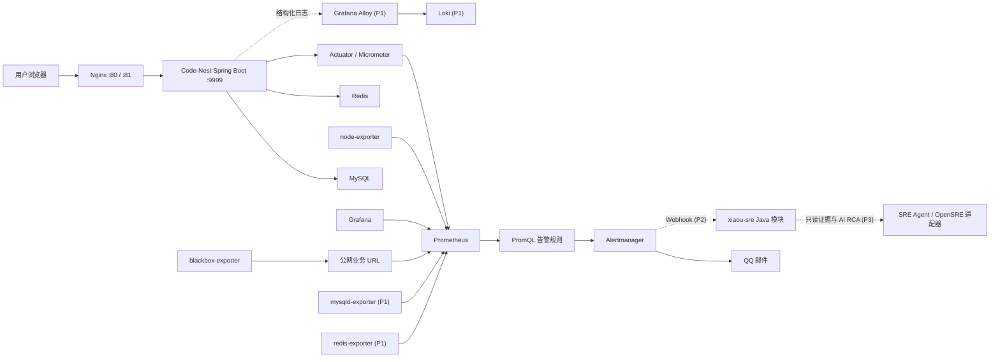

# Code-Nest 24x7 SRE 能力建设方案

> 状态：P0 配置已落地；P2.1-P2.3 Java 事故域与只读证据代码已落地，尚未在服务器完成运行验收
>
> 日期：2026-07-20
>
> 约束：当前只有一台服务器；紧急告警先使用 QQ 邮件；自动执行修复后置
>
> 详细技术架构：[Code-Nest SRE 目标技术架构](./Code-Nest-SRE-技术架构.md) · [可编辑 Draw.io 架构图](./code-nest-sre-target-architecture.drawio)

## 1. 决策结论

**继续以 Java 为 SRE 核心后端，保留 Vue/TypeScript 作为管理工作台前端；不要为
SRE 新开一个 TypeScript 后端项目。**

Code-Nest 已是 Java 17 + Spring Boot 3.4.4 的 Maven 多模块系统，已经具备
Actuator、Micrometer、Prometheus Registry、Druid、MyBatis 和后台管理端。把告警
事件、事故、证据、Runbook、审批和未来受控动作放在 Java 模块中，能够复用现有的
用户、权限、审计、数据库和 AI 能力；新建 TS 服务只会额外引入一套部署、鉴权、数据
模型和故障面。

OpenSRE 的正确定位是**可借鉴、可选集成的 AI 事故调查器**，不是 Code-Nest P0 的
监控底座，也不是当前应直接 fork 进项目的依赖。P0 的告警链必须是确定性的，不依赖
LLM、外部模型 API 或 AI 服务可用性。

## 2. 已知事实、推断与建议

### 2.1 已知事实

| 事实 | 依据 | 对方案的影响 |
| --- | --- | --- |
| Code-Nest 根工程使用 Java 17、Spring Boot 3.4.4、Maven 多模块。 | 根 `pom.xml`。 | SRE 领域后端应复用 Java 模块体系。 |
| `xiaou-common` 已传递引入 Actuator 和 Prometheus Registry，应用配置有 `/api/actuator/prometheus`。 | `xiaou-common/pom.xml`、`xiaou-application/src/main/resources/application.yml`。 | P0 不需要改造业务代码即可采 JVM 和 HTTP 指标。 |
| OpenSRE 是 Python 项目，`pyproject.toml` 要求 Python 3.12+，并依赖 FastAPI、MCP、LLM SDK、Kubernetes、AWS 等较宽的运行时依赖。 | [OpenSRE pyproject.toml](https://raw.githubusercontent.com/Tracer-Cloud/opensre/main/pyproject.toml)。 | 直接嵌入会新增一套重量级 Python 运行面和凭据管理面。 |
| OpenSRE README 明确标注为 public alpha，主要做告警上下文收集、证据关联、LLM 推理、报告与可选修复。 | [OpenSRE README](https://github.com/Tracer-Cloud/opensre)。 | 不能把它放在生产告警的唯一热路径。 |
| Prometheus Alerting Rules 适合用 `for` 持续时间抑制瞬时抖动，Alertmanager 负责分组、去重、静默和路由。 | [Prometheus alerting rules](https://prometheus.io/docs/prometheus/latest/configuration/alerting_rules/)、[Alertmanager](https://prometheus.io/docs/alerting/latest/alertmanager/)。 | 采集、判定、通知必须拆开。 |
| Spring Boot/Micrometer 的 Prometheus 聚合百分位数需要直方图 bucket；只在应用内计算 percentile 不能可靠聚合。 | [Spring Boot Metrics](https://docs.spring.io/spring-boot/3.4/reference/actuator/metrics.html)。 | 已为 `http.server.requests` 开启 histogram，才能计算 P95。 |

### 2.2 架构推断

1. 一台服务器上的 Prometheus、Alertmanager、应用和 blackbox-exporter 会一起随整机、
   电源、Docker 或机房网络故障而失效，因此它不能证明“真正异地 24x7 可用”。
2. 对当前规模，先建设确定性指标、邮件告警和可回溯事件，比先建设 AI Agent 更能缩短
   故障发现时间，并且风险更低。
3. 当日志、数据库指标和 Runbook 还没有结构化时，让 AI 自动根因分析只会产生看似
   合理但不可验证的结论。

### 2.3 建议

1. 立即上线 P0：单机监控、QQ 邮件、手工响应。
2. 连续运行两周后，根据真实流量与故障数据调阈值，再进入 P1。
3. P2 才建立 `xiaou-sre` Java 模块和后台工作台；P3 再接入只读 AI 诊断。
4. 自动执行必须放到 P4，且每个动作都要有明确前置条件、幂等性、回滚和审批审计。

## 3. OpenSRE 调研结论

OpenSRE 的价值不在于替代 Prometheus，而在于提供“告警后调查”的产品范式：从告警中
取上下文，查询日志、指标、Trace、部署和 Runbook，形成带证据链接的 RCA，并可在受控
情况下提出或执行动作。它的仓库将核心拆成调查编排、集成、工具注册、Guardrail、掩码、
沙箱和通知层，结构上值得借鉴。

但当前 Code-Nest 不应直接把 OpenSRE 作为生产依赖，原因如下：

1. 它仍处于 public alpha，接口和集成仍可能变化。
2. 它默认面对多云、Kubernetes、Slack/Telegram、MCP 和大量外部工具，当前单机项目不
   需要这些复杂度。
3. 它依赖模型服务和大量高权限集成；若放入告警热路径，会把“模型不可用、凭据异常、
   工具失败”变成新的告警失效原因。
4. 当前没有统一的日志库、Trace、事故 Runbook、只读数据库账号和审批模型，AI 的证据
   输入尚不完整。

因此建议采用 OpenSRE 的设计思想，而非复制其技术栈：

| OpenSRE 概念 | Code-Nest 对应实现 | 当前阶段 |
| --- | --- | --- |
| Alert ingress | Prometheus + Alertmanager | P0 |
| Evidence collection | Prometheus 查询、Loki 日志、只读 MySQL/Redis 指标、部署版本 | P1-P2 |
| Investigation state | `xiaou-sre` 中的 Incident、Evidence、Timeline | P2 |
| Tool guardrails | Java 工具权限、只读服务账号、审批策略、审计 | P2-P4 |
| LLM RCA | 只读 Java Agent 或独立 OpenSRE 适配器 | P3 |
| Remediation | 有审批的 Job/Runbook 执行器 | P4 |

## 4. 目标架构



### 4.1 P0 的检测与通知链

1. 应用通过 Actuator 暴露健康状态、JVM、HTTP 延迟和 HTTP 状态码指标。
2. Prometheus 每 10 秒抓取应用；每 15 秒抓取自身、主机和 blackbox 指标。
3. PromQL 规则每 30 秒计算一次；只有持续超过 `for` 时长才进入 firing。
4. Alertmanager 对同一 `alertname/job/instance` 分组、去重和限频。
5. Alertmanager 通过 QQ SMTP 授权码发送告警和恢复邮件。
6. Grafana 只做查询和人工观察，不承担告警判断。

这个链路故意不经过 AI。即使模型、AI 服务或未来的 `xiaou-sre` 模块不可用，P0 告警
仍然可以发出。

### 4.2 P0 中必须保持的网络边界

| 端口 | 用途 | 公网策略 |
| --- | --- | --- |
| 80, 81 | 用户端和管理端 Nginx | 按现有业务需要开放 |
| 9999 | Spring Boot 后端 | 不开放；由 Nginx 和本机监控访问 |
| 19090 | Prometheus UI/API | 仅 `127.0.0.1` 或 SSH 隧道 |
| 3000 | Grafana | 仅 `127.0.0.1` 或认证反代 |
| 19093, 19094, 19100, 19115 | Alertmanager、集群通信、node-exporter、blackbox-exporter | 仅 `127.0.0.1` |

`/api/actuator/` 已在 Nginx 上拒绝访问，但这**不能**保护直接暴露的 `9999`。腾讯云
安全组和服务器防火墙必须同时不允许互联网访问 TCP 9999；否则 Prometheus 指标、JVM
信息和 HTTP 路由标签会泄露给公网。

## 5. Java 与 TypeScript 的明确分工

| 能力 | 推荐技术 | 原因 |
| --- | --- | --- |
| 指标端点、健康检查、业务指标 | Java / Spring Boot / Micrometer | 与请求、线程池、数据库和业务事务同进程，指标语义准确。 |
| 事故、告警、Runbook、审批、审计 API | Java / `xiaou-sre` | 复用现有权限、MyBatis、用户与通知领域。 |
| Alertmanager Webhook 消费 | Java | 避免第二套鉴权、持久化和部署。 |
| AI 调查编排与受控工具调用 | Java 为主；必要时独立 Python/OpenSRE 适配器 | Java 管理业务边界与权限；AI 运行时可以独立演进，不污染告警链。 |
| SRE 工作台、图表、事故时间线 | Vue 3 + TypeScript | 与现有 `vue3-admin-front` 保持一致，适合交互和可视化。 |
| 采集器和基础监控 | Prometheus 生态组件 | 不自研采集协议和 TS/Java 轮询服务。 |

结论不是“永远不用 TypeScript”，而是**不要把 TypeScript 变成第二个后端平台**。前端
继续使用 TypeScript；未来若有独立的浏览器端实时视图，也仍可使用现有 Vue 技术栈。

## 6. P0 已落地的内容

本次 P0 只做检测、通知和记录准备，不做自动重启、删缓存、重建容器或 AI 处置。

| 文件 | 作用 |
| --- | --- |
| `docker/monitoring/docker-compose.yml` | 固定 Prometheus、Alertmanager、Grafana、node-exporter、blackbox-exporter 镜像与数据卷。 |
| `docker/monitoring/prometheus.yml` | 抓取应用、主机与 HTTP 探针，加载规则和 Alertmanager。 |
| `docker/monitoring/alert_rules.yml` | 可用性、5xx、P95、JVM 堆、磁盘与 CPU 规则。 |
| `docker/monitoring/alertmanager/alertmanager.yml.example` | QQ SMTP 465 隐式 TLS、分组、告警恢复邮件与频率。 |
| `docker/monitoring/targets/*.example` | 服务器本地应用目标与公网 URL 目标模板。 |
| `docker/monitoring/scripts/validate-config.sh` | 先检查 `.env`、目标、QQ 授权码和配置，再执行 Prometheus/Alertmanager/Docker Compose 验证。 |
| `xiaou-application/src/main/resources/application.yml` | 关闭健康详情泄露、开启健康 probes、HTTP histogram。 |
| `deploy/nginx/code-nest-113.44.190.45.conf` | 拒绝经 Nginx 访问 `/api/actuator/`。 |

### 6.1 初始告警规则

| 告警 | 条件 | 等级 | 初始目的 |
| --- | --- | --- | --- |
| `CodeNestTargetDown` | 应用指标连续 2 分钟抓取失败 | critical | JVM、端口或应用不可达。 |
| `CodeNestPublicEndpointDown` | HTTP 探针连续 2 分钟失败 | critical | Nginx、域名、证书、路由或业务入口不可达。 |
| `CodeNestHighHttpErrorRatio` | 5 分钟内 5xx 比例大于 5%，且有流量 | critical | 用户请求持续失败。 |
| `CodeNestHighHttpLatencyP95` | 5 分钟窗口 P95 大于 2 秒，持续 10 分钟 | warning | 用户体验退化。 |
| `CodeNestHighJvmHeapUsage` | 堆使用率大于 85%，持续 10 分钟 | warning | OOM 前的容量风险。 |
| `CodeNestHostDiskLow` | 可用磁盘低于 15%，持续 15 分钟 | warning | 预防数据库、日志和 Docker 写满。 |
| `CodeNestHostDiskCritical` | 可用磁盘低于 5%，持续 5 分钟 | critical | 即将影响系统写入和恢复。 |
| `CodeNestHostCpuHigh` | CPU 大于 90%，持续 15 分钟 | warning | 持续算力饱和。 |

这些是起点而不是永久 SLO。上线后至少收集两周的正常数据，再按实际流量、业务高峰、
GC、数据库容量和可接受延迟调参。Google SRE 对告警的建议也是先围绕用户体验 SLO 建立
可操作的告警，而非对每个资源瞬时值发页。[参考](https://sre.google/workbook/alerting-on-slos/)

### 6.2 P0 不做的事情

1. 不自动重启 Java、Docker、MySQL 或 Redis。
2. 不让 AI 决定告警是否触发。
3. 不给 MySQL/Redis 使用 root 账户去采集。
4. 不把 Prometheus、Grafana 或 Actuator 暴露在公网。
5. 不把 QQ 授权码、Grafana 初始密码或本地目标文件提交到 Git。

## 7. 单机服务器上线顺序

以下操作只应在你确认可访问服务器后执行。当前仓库完成的是静态配置，不等于已上线。

### 7.1 上线前检查

1. 在云安全组中确认只开放业务需要的 `80/81`（以及你自己的 SSH 管理端口），不开放
   `9999/3000/19090/19093/19094/19100/19115`。
2. 在服务器确认 Docker Compose v2 或 Podman Compose 可用，磁盘至少留出 Prometheus 30 天数据和 Grafana
   数据卷的空间。
3. 本机确认应用可访问：`curl -fsS http://127.0.0.1:9999/api/actuator/health`。
4. 确认 Nginx 生效后公网 `/api/actuator/health` 返回 404，而正常业务 API 仍可用。
5. 确认 QQ 邮箱已开启 SMTP，并准备的是 SMTP 授权码，不是网页登录密码。

### 7.2 配置与启动

在服务器的 `docker/monitoring` 目录执行：

```bash
cp .env.example .env
cp targets/code-nest.local.yml.example targets/code-nest.local.yml
cp targets/blackbox.local.yml.example targets/blackbox.local.yml
cp alertmanager/alertmanager.yml.example alertmanager/alertmanager.local.yml
mkdir -p secrets
: > secrets/sre_webhook_token
chown 65534:65534 secrets/sre_webhook_token
chmod 400 secrets/sre_webhook_token
chmod 711 secrets
```

然后完成以下人工配置：

1. 监控服务使用 Linux host network 访问 loopback，保持
   `targets/code-nest.local.yml` 的默认目标 `127.0.0.1:9999`。
2. 将 `targets/blackbox.local.yml` 改成真实的公网 HTTPS URL，优先使用域名而非裸 IP。
3. 在 `alertmanager.local.yml` 填 QQ 发件箱和收件箱。
4. 将 QQ SMTP 授权码写入 `secrets/qq_smtp_auth_code`，并设置 `600` 权限。
5. 修改 `.env` 中的 Grafana 管理员强密码，保持 Prometheus 和 Grafana 仅绑定
   `127.0.0.1`。

之后执行：

```bash
chmod +x scripts/validate-config.sh scripts/compose.sh
./scripts/validate-config.sh
./scripts/compose.sh --env-file .env up -d
./scripts/compose.sh --env-file .env ps
```

`validate-config.sh` 会调用镜像内的 `promtool`、`amtool` 和实际可用的 Compose 实现。
它应在真实 Linux 服务器上执行，因为本地 Windows 工作区没有 Docker 和 Nginx 可供运行。

### 7.3 首次验收演练

1. 通过 SSH 隧道或服务器本机检查 Prometheus `/targets`，确认 application、node-exporter、
   blackbox-exporter 都是 `UP`。
2. 在 Alertmanager 中发送一条测试告警，验证 QQ 收件、标题、分组和恢复邮件。
3. 在维护窗口短暂停止应用，确认两条可用性告警在预期时间后到达；恢复应用后确认
   resolved 邮件。
4. 从手机流量或另一台独立网络访问公网 URL，确认页面可达。不要把本机 blackbox 成功
   当成异地可用性证明。
5. 检查 `./scripts/compose.sh --env-file .env logs`、Prometheus 告警状态和 Grafana 数据源，记录验收时间与结果。

## 8. P1：完整可观测性基线

P1 的目标是让每一个 critical 告警都能在 10 分钟内由值守者定位到“应用、数据库、缓存、
外网、主机、最近发布”中的一个责任域。

### 8.1 增加的组件

| 能力 | 推荐组件 | 前置条件 |
| --- | --- | --- |
| 结构化日志采集 | Grafana Alloy + Loki | 日志脱敏规则、保留周期、磁盘预算。 |
| MySQL 指标 | `mysqld-exporter` | 专用只读账户，只授予 exporter 所需权限。 |
| Redis 指标 | `redis-exporter` | 专用 ACL 用户或最小权限凭据。 |
| 异地可用性 | 独立云监控/第三方 Uptime 或第二台低配节点 | 与生产机不同的网络和故障域。 |
| 发布关联 | CI/CD 写入版本、Git SHA、发布时间到 Prometheus/Grafana annotation | 明确部署流程。 |
| 数据库备份巡检 | 备份作业成功时间、最近备份年龄、恢复演练结果 | 现有备份流程。 |

推荐 Alloy 而非新建 Promtail：Alloy 是 Grafana 当前面向采集、处理与转发的统一 Agent；
Loki 负责日志索引和查询，而不是代替数据库长期保存所有业务数据。参考 [Grafana Alloy
文档](https://grafana.com/docs/alloy/latest/) 和 [Loki 文档](https://grafana.com/docs/loki/latest/)。

### 8.2 P1 告警补充

1. MySQL 连接错误、慢查询、复制/备份失败、InnoDB 空间风险。
2. Redis 内存逼近 `maxmemory`、拒绝连接、命中率异常、持久化失败。
3. Java GC pause、线程池队列、文件描述符、上传目录容量。
4. Nginx 4xx/5xx、证书到期、域名 DNS 解析失败。
5. 错误日志速率，并为每条告警保留 Grafana/Prometheus/Loki 深链接。

## 9. P2：`xiaou-sre` Java 模块与管理工作台

P2 不负责采集指标，而是把外部监控事件转成项目内可管理的事故生命周期。建议新建
`xiaou-sre` Maven 模块，并由 `xiaou-application` 聚合加载；不要把 SRE 逻辑散落到
`xiaou-system` 或 Controller 中。

### 9.1 领域模型

| 实体 | 关键字段 | 责任 |
| --- | --- | --- |
| `SreAlertEvent` | fingerprint、source、status、severity、labels、startsAt、endsAt、rawPayload | 原始告警的幂等接收和状态变更。 |
| `SreIncident` | incidentNo、status、priority、service、owner、summary、startedAt、resolvedAt | 多个相关告警聚合出的事故。 |
| `SreIncidentEvidence` | incidentId、sourceType、url、query、snapshot、capturedAt | Prometheus、日志、部署、DB 的可验证证据。 |
| `SreRunbook` | service、trigger、version、content、approvalPolicy | 人工和未来 Agent 的标准处置步骤。 |
| `SreActionProposal` | incidentId、actionType、reason、risk、rollbackPlan、status | AI 或人工提出的动作，尚未执行。 |
| `SreActionExecution` | proposalId、executor、approvalId、startedAt、result、auditTrail | 已批准动作的不可抵赖审计。 |

### 9.2 接口与安全边界

1. Alertmanager webhook 只接收来自监控网络的请求，使用独立服务凭据或 HMAC；不能复用
   管理员浏览器 Token。
2. 内部 API 先提供告警列表、事故详情、确认、指派、静默建议、证据查询和 Runbook 查看。
3. 所有写操作记入现有审计体系；事件幂等键使用 Alertmanager fingerprint + 状态版本。
4. 管理端通过 `vue3-admin-front` 展示事故队列、时间线、告警分组、证据链接和 Runbook。
5. P2 仍不允许该模块直接执行服务器命令。

## 10. P3：只读 AI 诊断

当 P1/P2 已有稳定的指标、日志、Runbook 和事件模型后，才引入 AI。此时可以选择：

1. 在 Java 中实现一个受控 SRE Agent，直接调用现有 OpenAI-compatible 模型；或
2. 将 OpenSRE 作为独立、可替换的 Python 服务，通过一个窄的 Adapter 接口接收事故和
   返回结构化调查报告。

无论选择哪种，实现必须满足：

| 要求 | 规则 |
| --- | --- |
| 输入 | 只发送必要且已脱敏的指标、日志片段、版本与 Runbook，不发送数据库密码、Token、完整用户数据。 |
| 工具 | P3 只允许 `READ_ONLY`：PromQL、Loki 查询、部署记录、只读数据库查询。 |
| 输出 | 必须区分“观测事实、假设、置信度、证据 URL、建议动作”。 |
| 人工控制 | AI 只能创建 `SreActionProposal`，不能直接调用 Shell、Docker、数据库写操作或云 API。 |
| 失败模式 | AI 失败、超时或成本超限不影响 Alertmanager 邮件和人工处置。 |
| 防护 | 对日志、网页内容和外部系统返回文本视为不可信输入，防止提示词注入改变工具权限。 |

OpenSRE 的“证据优先、工具受控、可选修复”思路适合这里，但它本身不是权限模型的替代品。

## 11. P4：受控自动修复的准入门槛

只有以下条件都满足，才讨论自动执行：

1. 至少两周稳定监控基线，且有真实告警样本。
2. 目标动作是确定性、幂等、可回滚的 Runbook 步骤。
3. 动作有独立的服务账号、最小权限、超时、并发锁和审计记录。
4. 每个动作都有 dry-run、人工批准模式和明确的成功/失败指标。
5. 已在预发布或隔离环境完成故障演练。
6. 有异地监控，否则整机失联时无法验证修复是否真的成功。

第一批可候选的动作应是低风险且可逆的，例如“清理已验证的临时文件”或“重新加载一份
已验证的 Nginx 配置”。不要把“重启数据库”“清空 Redis”“删除 Docker 卷”“执行 AI 生成
SQL”列入早期自动化范围。

## 12. SLO 与告警演进

P0 的资源阈值是保障基础，P1 后应逐步转为用户体验 SLO：

| SLI | 初始定义 | 未来告警方式 |
| --- | --- | --- |
| 可用性 | 成功 HTTP 探针数 / 总探针数 | 5 分钟快速燃烧 + 1 小时慢速燃烧。 |
| 请求成功率 | 非 5xx 请求 / 全部业务请求 | 按核心 API 或用户路径拆分。 |
| 延迟 | 核心页面/API 的 P95/P99 | 与用户路径和流量阈值一起计算。 |
| 数据安全 | 最近一次成功备份年龄、恢复演练结果 | 备份超期直接通知。 |

不要一开始承诺一个没有业务基线支撑的 99.9%。先收集真实可用性、流量和延迟，定义用户
真正使用的关键路径，再计算错误预算并把报警对齐到它。

## 13. 验收标准与阶段门

| 阶段 | 必须满足 | 才能进入下一阶段 |
| --- | --- | --- |
| P0 | 指标目标全 `UP`；QQ 测试告警与恢复邮件成功；Nginx 拒绝 Actuator；公网无法直连 9999。 | P1 |
| P1 | 日志、MySQL、Redis、异地探针至少各有一个可验证数据源；critical 告警有证据链接。 | P2 |
| P2 | Alertmanager 事件幂等入库；事故可确认/指派/关闭；完整审计和权限测试通过。 | P3 |
| P3 | AI 仅能读取；每条结论可回链证据；敏感数据脱敏和 prompt-injection 测试通过。 | P4 |
| P4 | 每个动作有 dry-run、审批、回滚、限频、演练和独立监控验证。 | 有限自动化 |

## 14. 当前最优先的下一步

1. 在服务器完成 P0 的 `.env`、QQ 授权码、目标 URL 配置和 `validate-config.sh` 验证。
2. 进行一次“应用停止再恢复”的维护窗口演练，记录 QQ 邮件时间和 resolved 时间。
3. 连续观察两周，收集误报、缺报、峰值 CPU、内存、磁盘、5xx、P95。
4. 决定 P1 的日志保留周期、MySQL/Redis 最小权限账号和异地探针预算。

在 P0 验收前，不要启动 `xiaou-sre` 模块开发，更不要把 OpenSRE 或 AI 自动修复接入生产。

## 15. 主要外部资料

1. [OpenSRE README](https://github.com/Tracer-Cloud/opensre)：定位、public alpha 状态、事故调查流程与集成范围。
2. [OpenSRE pyproject.toml](https://raw.githubusercontent.com/Tracer-Cloud/opensre/main/pyproject.toml)：Python 运行时与依赖边界。
3. [OpenSRE architecture reference](https://raw.githubusercontent.com/Tracer-Cloud/opensre/main/AGENTS.md)：调查编排、工具、集成和 Guardrail 分层。
4. [Prometheus Alerting Rules](https://prometheus.io/docs/prometheus/latest/configuration/alerting_rules/)：规则、`for` 持续时间与标签/注释模型。
5. [Prometheus Alertmanager](https://prometheus.io/docs/alerting/latest/alertmanager/)：分组、去重、静默和通知路由。
6. [Spring Boot 3.4 Metrics](https://docs.spring.io/spring-boot/3.4/reference/actuator/metrics.html)：Micrometer、Prometheus registry 与 histogram 配置。
7. [Google SRE Workbook: Alerting on SLOs](https://sre.google/workbook/alerting-on-slos/)：以用户体验和错误预算建立可操作告警。
8. [Grafana Alloy documentation](https://grafana.com/docs/alloy/latest/) 与 [Loki documentation](https://grafana.com/docs/loki/latest/)：P1 日志采集与查询方案。
