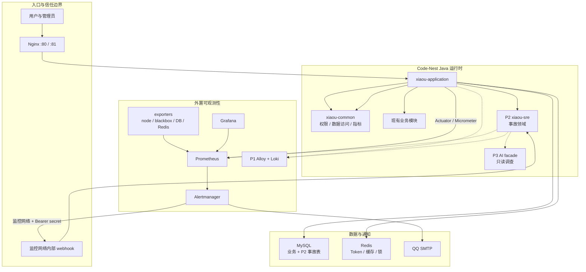
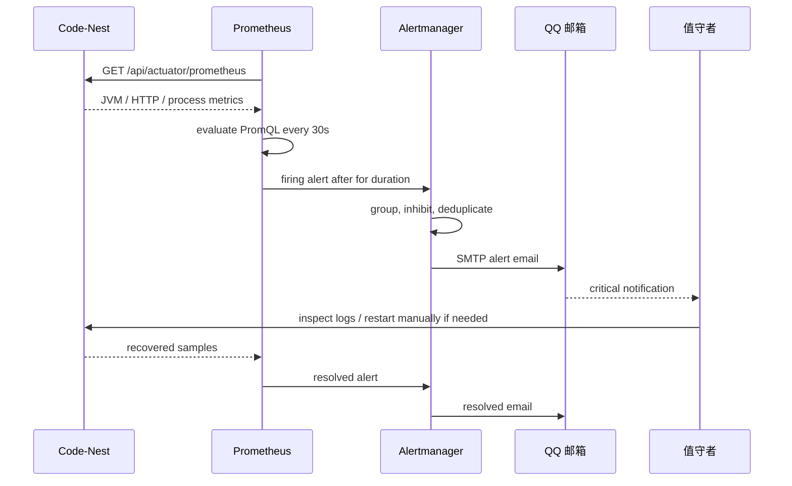

# Code-Nest SRE 目标技术架构

> 文档类型：技术架构设计
>
> 版本：v1.3（P3.4 脱敏回放输入与 provenance 已落地）
>
> 日期：2026-07-23
>
> 关联方案：[Code-Nest 24x7 SRE 能力建设方案](./Code-Nest-24x7-SRE-方案.md)
>
> 架构图：[code-nest-sre-target-architecture.drawio](./code-nest-sre-target-architecture.drawio)

## 1. 架构结论

本项目采用**模块化单体 + 外置可观测性基础设施 + 可插拔 AI 调查器**的路线：

1. 业务系统继续是 Java 17 + Spring Boot 3.4.4 的主应用，不拆成第二个 TypeScript
   后端。
2. Prometheus、Alertmanager、Grafana、node-exporter、blackbox-exporter 作为 P0
   基础设施运行在 Docker 中，告警判定不依赖 Java SRE 模块和 LLM。
3. P2 新增 `xiaou-sre` Maven 模块，负责告警事件、事故生命周期、证据、Runbook、审批
   和审计；它是事故域，不是采集器，也不是执行器。
4. P3 已接入只读 AI 调查。AI 只能读取经过授权的证据并生成诊断报告或人工动作建议，不能
   直接重启服务、写数据库或执行 Shell。
5. P4 才讨论自动修复，而且每个动作必须有幂等性、回滚、审批、限频和审计。
6. Vue 3 管理端继续承载 SRE 工作台。当前管理端源码以 `.vue` 和 `.js` 为主，新的
   SRE 页面可以逐步采用 TypeScript，不需要另起一个前端平台。

这不是“先做一个 AI，再补监控”的架构，而是先保证检测、告警和人工处置可用，再让 AI
消费已经结构化的证据。

## 2. 设计范围与非目标

### 2.1 本架构覆盖

- 单台服务器的主机、应用、HTTP 入口和 JVM 监控。
- QQ SMTP 告警、告警分组、抑制和恢复通知。
- P1 的日志、MySQL、Redis、异地探针扩展点。
- P2 的告警入库、事故聚合、证据时间线和后台管理接口。
- P3 的只读 AI RCA、工具权限和证据引用。
- P4 自动修复的安全准入边界。

### 2.2 明确不做

- P0 不实现自动重启、自动清缓存、自动执行 SQL 或 AI 决策。
- P0 不建设 Kafka、RabbitMQ、Kubernetes、服务网格或第二个后端运行时。
- P0 不将 Prometheus、Grafana、Actuator 直接暴露到公网。
- P2 不把完整 OpenSRE 仓库复制进 Code-Nest。
- P3 不允许 AI 绕过现有管理员权限和审计链路。

## 3. 当前系统基线

### 3.1 代码与运行入口

| 位置 | 当前职责 | 架构约束 |
| --- | --- | --- |
| 根 `pom.xml` | Java 17、多模块 Maven 聚合 | 新 SRE 模块应加入根聚合，不另建独立后端仓库。 |
| `xiaou-application` | Spring Boot 启动模块，端口 `9999`，context path `/api` | 业务模块和未来 `xiaou-sre` 由它统一装配。 |
| `xiaou-common` | Web、MyBatis、Druid、Redis、Sa-Token、Actuator、Micrometer | SRE 使用公共能力，但不把事故领域模型放进 common。 |
| `xiaou-system` | 管理员、系统配置和现有 Admin Agent | P3 已放置薄的 RCA 编排服务和 AgentTool，`xiaou-sre` 不反向依赖 system。 |
| `xiaou-ai` | LangChain4j/LangGraph4j 和统一 AI facade | P0 不依赖；P3 复用统一 Prompt、结构化输出、超时、重试和成本指标。 |
| `xiaou-notification` | 业务通知模块 | 不替代 Alertmanager 的 critical 邮件链；P2 可用于站内事件提醒。 |
| `vue3-admin-front` | Vue 3 管理端，路由和 API 目录按模块组织 | P2 新增 SRE 菜单、页面和 API，不开新前端应用。 |
| `deploy/nginx` | 80 用户端、81 管理端，反代本地 `127.0.0.1:9999` | Actuator 通过 Nginx 返回 404；公网入口只有业务路由。 |

### 3.2 现有观测能力

`xiaou-common` 已经引入：

- `spring-boot-starter-actuator`；
- `micrometer-registry-prometheus`；
- Druid 连接池；
- Redis、MyBatis 和 HTTP 基础设施。

应用配置已经开启：

```text
/api/actuator/health
/api/actuator/metrics
/api/actuator/prometheus
```

健康详情设置为不对外暴露，健康 probes 开启，`http.server.requests` 使用 histogram，
这样 Prometheus 才能在服务端计算聚合 P95。

### 3.3 现有 Agent 能力

`xiaou-system` 已有 `AgentTool`、`AgentExecutionContext`、工具风险级别和只读运行时
观测工具。未来的 SRE Agent 应复用其风险分类思想，但不能把 SRE 事故接收直接绑定到
`/admin/agent/chat`：

- Alertmanager webhook 是机器到机器通信，不是浏览器用户操作；
- webhook 必须独立认证、独立限流和独立审计；
- AI 调查是事故发生后的可选消费者，不是告警接收入口。

## 4. 总体架构分层



### 4.1 分层职责

#### A. 业务运行层

由 `xiaou-application` 统一启动现有业务模块。它提供：

- 业务 API 和管理 API；
- Actuator/Micrometer 指标；
- 统一 Sa-Token 登录和权限；
- 现有 MySQL、Redis、文件和 AI 依赖。

业务运行层不负责判断告警，也不负责把日志推给 LLM。

#### B. 监控基础设施层

由 Docker Compose 管理：

- Prometheus：定时抓取和计算规则；
- Alertmanager：分组、抑制、去重、恢复和 QQ 邮件路由；
- Grafana：查询和展示；
- node-exporter：主机 CPU、内存、文件系统；
- blackbox-exporter：从当前服务器探测公网 URL；
- P1 Alloy/Loki：日志采集和查询；
- P1 `mysqld-exporter`、`redis-exporter`：数据库和缓存指标。

基础设施层不调用业务写接口，不执行修复动作。

#### C. 事故领域层

由 P2 `xiaou-sre` 提供：

- Alertmanager 事件接入；
- fingerprint 幂等；
- 告警到事故的聚合；
- 事故状态、Owner、时间线；
- 证据收集任务和可回链快照；
- Runbook 版本和审批策略；
- 动作提案与审计。

它可以不可用，但不能阻断 Alertmanager 向 QQ 发邮件。

#### D. AI 调查层

P3 已通过 `xiaou-system` 的薄编排层接入 `xiaou-ai` 统一运行时：

- 只读取 `SreInvestigationFacade` 返回的事故摘要和已入库证据，不向模型开放任意
  PromQL、LogQL、Shell、SQL、Docker 或网络工具；
- 先在后端完成数量限制、上下文裁剪和递归脱敏，再让模型输出观察、根因假设、置信度、
  反证、限制和人工下一步；
- 所有 observation、hypothesis 和 recommendation 的证据 ID 都由后端对白名单复核，
  无效引用被移除并触发结论降级；
- 推荐风险只允许 `READ_ONLY` 或 `PROPOSE_ONLY`，报告的 `executionAllowed` 由 DTO
  不变量强制为 `false`；
- 模型不可用、超时、异常或输出不符合结构化契约时，返回确定性的 `FALLBACK` 证据报告，
  不影响 P0/P1/P2 告警链路。

## 5. P0 单机部署架构

### 5.1 物理拓扑

架构图第一页是 P0 的物理拓扑，关键故障域是“整台服务器”：

```text
公网用户 / 管理员
        |
        v
  Nginx :80/:81 --------> Code-Nest :9999 --------> MySQL / Redis
        |                         ^
        |                         | /api/actuator/prometheus
        |                         |
        +---- 公网业务 URL <--- blackbox-exporter
                                  ^
node-exporter --------------------+
                                  |
                            Prometheus
                             /      \
                    Grafana       Alertmanager ----QQ SMTP----> 邮箱
```

注意：当前 blackbox-exporter 与 Prometheus 和应用同机，只能证明该服务器上的探测路径
是否成功；它不能检测整台服务器断电、宕机或出口网络完全中断。异地探针必须在 P1 增加。

### 5.2 P0 端口策略

| 端口 | 监听者 | 网络可见性 | 说明 |
| --- | --- | --- | --- |
| 80 | Nginx 用户端 | 公网 | 业务网站和 API。 |
| 81 | Nginx 管理端 | 公网或办公网 | 后台管理入口。 |
| 9999 | Spring Boot | 本机/监控网络 | 云安全组禁止互联网访问。 |
| 19090 | Prometheus | `127.0.0.1` | 使用 SSH 隧道查看；避开 Cockpit 的 9090。 |
| 3000 | Grafana | `127.0.0.1` | 使用 SSH 隧道或认证反代。 |
| 19093 | Alertmanager | `127.0.0.1` | host network 下仅本机监听。 |
| 19094 | Alertmanager 集群通信 | `127.0.0.1` | 单机运行时不对外开放。 |
| 19100 | node-exporter | `127.0.0.1` | host network 下仅本机监听。 |
| 19115 | blackbox-exporter | `127.0.0.1` | host network 下仅本机监听。 |

Nginx 的 `/api/actuator/` 404 规则是应用层防护；云安全组、服务器防火墙和各监控服务的
loopback 监听是网络层防护，三层不能只依赖其中一层。

### 5.3 P0 告警生命周期



P0 告警条件只做“足够确定、能行动”的规则：应用不可达、公网入口不可达、5xx 比例、
P95、JVM 堆、磁盘和 CPU。瞬时 CPU 或单次请求失败不直接发送 critical 邮件。

## 6. P2 `xiaou-sre` 模块边界

### 6.1 模块依赖原则

推荐的依赖方向：

```text
xiaou-application
      |
      +--> xiaou-sre ------> xiaou-common
      |          |
      |          +---------> (P3 xiaou-ai，可选)
      |
      +--> 现有业务模块

xiaou-system --(P3 薄适配器)--> xiaou-sre facade
```

具体约束：

1. `xiaou-sre` 可以依赖 `xiaou-common`，使用公共响应、Sa-Token、MyBatis、事务和配置。
2. `xiaou-sre` 不依赖整个 `xiaou-system`，避免把管理 Agent 和事故领域形成反向耦合。
3. P3 如果现有 Agent 需要调查能力，在 `xiaou-system` 增加薄 adapter，调用 SRE 的
   `SreInvestigationFacade`；SRE 模块不认识 AgentTool 具体实现。
4. P0/P1 不把 `xiaou-ai` 加到 SRE 运行时路径；P3 再通过可选 client 或 facade 接入。
5. Alertmanager 的 QQ 邮件不经过 `xiaou-notification`，避免业务通知模块故障影响紧急
   运维告警。

### 6.2 推荐包结构

```text
xiaou-sre/
  pom.xml
  src/main/java/com/xiaou/sre/
    controller/
      admin/
        SreAdminController.java
      internal/
        AlertmanagerWebhookController.java
    service/
      AlertIngestionService.java
      IncidentLifecycleService.java
      EvidenceCollectionService.java
      RunbookService.java
      ActionProposalService.java
    domain/
      SreAlertEvent.java
      SreIncident.java
      SreIncidentEvidence.java
      SreRunbook.java
      SreActionProposal.java
      SreIncidentState.java
    mapper/
      SreAlertEventMapper.java
      SreIncidentMapper.java
      SreEvidenceMapper.java
      SreOutboxMapper.java
    client/
      PrometheusClient.java
      LokiClient.java
      DeploymentEvidenceClient.java
    security/
      InternalWebhookAuthenticationFilter.java
      SrePermissionEvaluator.java
    workflow/
      SreOutboxWorker.java
      EvidenceCollectionTask.java
    dto/
      request/
      response/
```

这是按当前项目的 `controller/service/mapper/domain` 风格组织的模块，而不是引入一套与
现有代码完全不一致的框架。包名可以按代码库实际规范调整，但依赖方向必须保持不变。

### 6.3 入口 API

#### 内部 webhook

```text
POST /api/internal/sre/alertmanager/v1/alerts
```

用途：接收 Alertmanager firing/resolved 事件。

安全要求：

- 只允许 Docker 监控网络到达；
- 使用独立 Bearer secret 或 HMAC，不能使用管理员浏览器 Token；
- 校验请求时间、body hash、最大 body 大小和重放窗口；
- 接收接口只做校验、幂等写入和 outbox 写入，成功后快速返回 `2xx`；
- 证据查询、AI 调查和通知编排全部异步执行。

现有 `SaTokenConfig` 只对 `/auth/**`、`/admin/**` 和 `/user/**` 做业务登录拦截，
因此 `/api/internal/sre/**` 必须显式增加机器认证过滤器和公网拒绝规则，不能因为没有
浏览器登录校验就误认为它安全。

#### 管理 API

```text
GET  /api/admin/sre/incidents
GET  /api/admin/sre/incidents/{incidentId}
POST /api/admin/sre/incidents/{incidentId}/ack
POST /api/admin/sre/incidents/{incidentId}/assign
POST /api/admin/sre/incidents/{incidentId}/resolve
GET  /api/admin/sre/incidents/{incidentId}/timeline
GET  /api/admin/sre/incidents/{incidentId}/evidence
GET  /api/admin/sre/runbooks
POST /api/admin/sre/runbooks
POST /api/admin/sre/action-proposals/{proposalId}/approve
```

P2 只开放事件确认、指派、关闭、证据查看和 Runbook 管理。`approve` 接口先只记录审批，
不执行动作；真正的 execute API 留到 P4，并且需要更高权限和二次确认。

#### 未来只读查询接口

```text
GET /api/admin/sre/overview
GET /api/admin/sre/metrics
GET /api/admin/sre/availability
```

Grafana 仍然是原始时序数据的查询工具；这些 API 只负责事故域汇总，不复制完整的
Prometheus 数据。

### 6.4 事件接收事务

事件接收需要采用“同步落库 + 异步证据”的模式：

```text
Alertmanager webhook
      |
      v
WebhookAuthenticationFilter
      |
      v
AlertIngestionService (@Transactional)
  1. validate payload
  2. derive fingerprint and payload hash
  3. upsert SreAlertEvent
  4. create/update SreIncident
  5. insert SreOutboxEvent
      |
      +--> return 2xx quickly
      |
      v
SreOutboxWorker (bounded executor)
  6. collect PromQL / Loki / deployment evidence
  7. append timeline
  8. optionally enqueue read-only AI investigation
```

单机阶段不引入 MQ。MySQL transactional outbox 能保证“告警事件已经落库”和“后续任务
不会因为进程瞬时重启而彻底丢失”。若未来变成多节点，再把 outbox worker 替换为带租约
和分布式锁的消费者；不需要先为单机支付消息中间件成本。

## 7. 领域模型与状态机

### 7.1 核心实体

| 实体 | 必要字段 | 唯一性/约束 | 说明 |
| --- | --- | --- | --- |
| `SreAlertEvent` | `source`、`fingerprint`、`status`、`severity`、`labelsJson`、`startsAt`、`endsAt`、`rawPayload` | `(source, fingerprint, startsAt)` 唯一 | 同一告警的 firing/resolved 更新必须幂等。 |
| `SreIncident` | `incidentNo`、`service`、`priority`、`state`、`ownerId`、`summary`、`startedAt`、`resolvedAt` | `incidentNo` 唯一 | 多条相关告警聚合成一个事故。 |
| `SreIncidentAlertRel` | `incidentId`、`alertEventId`、`relationType` | 组合唯一 | 记录告警与事故的关联。 |
| `SreIncidentEvidence` | `incidentId`、`sourceType`、`query`、`snapshot`、`url`、`capturedAt` | 同一采集任务幂等 | 保存可回链的事实，不保存无限制原始日志。 |
| `SreRunbook` | `service`、`trigger`、`version`、`content`、`approvalPolicy` | 服务+版本唯一 | Runbook 必须可审阅、可回滚。 |
| `SreActionProposal` | `incidentId`、`actionType`、`risk`、`reason`、`rollbackPlan`、`state` | 提案版本递增 | P3 AI 只能创建该实体。 |
| `SreActionExecution` | `proposalId`、`approvalId`、`executor`、`result`、`auditTrail` | 一个提案可多次尝试但每次有 executionId | P4 才启用。 |
| `SreOutboxEvent` | `aggregateType`、`aggregateId`、`eventType`、`payload`、`state`、`nextAttemptAt` | `eventId` 唯一 | 异步证据采集和通知任务。 |

### 7.2 状态机

告警状态：

```text
FIRING --> ACKNOWLEDGED --> RESOLVED
   |            |
   +------------+
     误报/关闭
```

事故状态：

```text
OPEN -> ACKNOWLEDGED -> INVESTIGATING -> MITIGATED -> RESOLVED -> CLOSED
  |          |               |
  +----------+---------------+
        允许人工备注和重新打开
```

动作提案状态：

```text
DRAFT -> PENDING_APPROVAL -> APPROVED -> EXECUTING -> SUCCEEDED
                                  |          |
                              CANCELLED    FAILED
```

状态迁移必须在服务层完成，Controller 不能直接更新数据库状态。每一次迁移写入审计，
并保留操作者、原因、请求 ID 和前一状态。

## 8. 证据与 AI 架构

### 8.1 证据优先级

AI 或人工查看证据时，按以下优先级拼装上下文：

1. 直接事实：Prometheus 的 `up`、HTTP 5xx、延迟、JVM、磁盘、DB/Redis 指标。
2. 时间关联：最近部署版本、配置变更、告警开始时间、日志时间窗口。
3. 结构化日志：按 trace/request id、service、level、error code 过滤。
4. Runbook：服务责任人、已知故障模式、可做与不可做的动作。
5. AI 推断：必须明确标为假设，并带有证据链接和置信度。

AI 不得把“没有查到证据”写成“没有问题”。所有工具都应该返回 `observedAt`、查询
范围、结果数量上限和数据源 URL。

### 8.2 工具风险分层

| 风险 | P3 权限 | 例子 |
| --- | --- | --- |
| `READ_ONLY` | 允许 | PromQL、Loki 查询、发布信息、Runbook 查看。 |
| `PROPOSE_ONLY` | 允许生成提案 | 清理临时文件、reload Nginx、重启应用。 |
| `APPROVED_EXECUTE` | P4 且审批后 | 执行已签名、可回滚的 Runbook。 |
| `DESTRUCTIVE` | 默认拒绝 | 删除 Docker 卷、清空 Redis、写数据库、修改云安全组。 |

现有 `xiaou-system` Agent 已有 `readonly`、`READONLY`、destructive 等风险概念；SRE
模块应在事故动作上使用同一套语义，但权限判定和审计仍由 SRE 自己负责，不能仅靠模型
提示词约束。

### 8.3 OpenSRE 适配方式

不直接复制 OpenSRE 的 Python 内部模块，而是定义一个窄 Adapter：

```text
interface SreInvestigationPort {
    InvestigationRequest buildRequest(IncidentId incidentId);
    InvestigationReport investigate(InvestigationRequest request);
}
```

Java 侧负责：

- 事故权限；
- 证据脱敏；
- 可发送字段白名单；
- 调用超时、重试、成本统计；
- 报告结构化入库；
- 失败降级。

OpenSRE 或其他 Python Agent 只负责调查编排，不负责决定 Code-Nest 的数据库模型、
管理员权限和生产动作。

## 9. 安全架构

### 9.1 四个信任边界

| 边界 | 进入方式 | 必须防护 |
| --- | --- | --- |
| 公网到 Nginx | HTTP/HTTPS | TLS、请求大小、业务鉴权、Actuator 拒绝。 |
| Nginx 到应用 | 本机 loopback | 反代头、超时、连接数、后端端口不公网开放。 |
| 监控网络到应用 | Docker host gateway | 目标只读、端口不公网开放、webhook 独立 Bearer/HMAC。 |
| Java 到 LLM/外部数据源 | 出站 HTTP | 凭据隔离、超时、域名白名单、日志脱敏、成本限制。 |

### 9.2 凭据

- QQ SMTP 授权码只存服务器 `secrets/qq_smtp_auth_code`。
- Alertmanager 本地配置和 `.env` 不提交 Git。
- P1 MySQL/Redis exporter 使用专用只读账号或 Redis ACL。
- P2 webhook 使用独立机器凭据，不能复用 Sa-Token 管理员 token。
- P3 LLM API Key 由应用环境变量或 Secret 注入，禁止写在 Runbook、日志和事故快照中。

### 9.3 审计

以下动作必须产生审计记录：

- 事故确认、指派、关闭和重新打开；
- Runbook 新建、修改、发布和废弃；
- AI 调查开始、使用的数据源和结果；
- 动作提案创建、批准、拒绝、取消；
- P4 动作执行的命令版本、操作者、开始/结束时间和结果。

## 10. 性能、并发与故障降级

### 10.1 P0 资源预算

P0 的目标不是高吞吐，而是低复杂度和可恢复：

- Prometheus 抓取间隔 10-15 秒，保留 30 天；
- Alertmanager 只发送 QQ 邮件，不在 Java 内重复发送；
- Grafana 查询通过 Prometheus，不复制时序数据到 MySQL；
- node-exporter、blackbox-exporter 和 Alertmanager 不映射公网端口；
- 整个监控栈使用独立 Docker volumes，避免容器重建丢数据。

实际内存和磁盘要在服务器验收时记录，不在没有主机规格的情况下承诺固定容量。

### 10.2 P2 并发策略

1. webhook 接收线程只做鉴权、JSON 校验、幂等 upsert 和 outbox 写入。
2. 证据采集使用现有 `ApplicationTaskExecutorConfig` 的有界 I/O 线程池或 SRE 专用有界
   executor，禁止无限制创建线程。
3. 每个 incident 同时最多一个 evidence collection worker，使用 MySQL 行锁或 Redis
   短租约避免重复查询。
4. PromQL/Loki 查询设置连接超时、读取超时、最大返回条数和熔断；外部查询失败只能
   标记证据缺失，不能阻塞事故关闭。
5. webhook 处理失败由 Alertmanager 重试；数据库持续不可用时，QQ 邮件仍由
   Alertmanager 独立发送。

### 10.3 关键降级矩阵

| 故障 | 用户业务 | QQ 告警 | 事故工作台 | AI 调查 |
| --- | --- | --- | --- | --- |
| Grafana 挂掉 | 不影响 | 不影响 | 可用但无图表 | 可查 Prometheus |
| Java 挂掉 | 不可用 | Prometheus/Alertmanager 仍可告警 | 不可用 | 不可用 |
| Alertmanager 挂掉 | 不影响 | 不可用 | 可能收到历史事件，不保证实时 | 不影响已存数据 |
| MySQL 挂掉 | 业务按现状受影响 | 主机/HTTP 监控仍可告警 | 无法持久化事故 | 必须停止新调查 |
| LLM 挂掉 | 不影响 | 不影响 | 证据仍可查 | 降级人工 |
| 整台服务器掉电 | 不可用 | 同机监控也不可用 | 不可用 | 需要 P1 异地探针发现 |

## 11. SRE 自身的指标

P2 开始，SRE 模块必须暴露自己的指标，让“监控系统也被监控”：

| 指标 | 类型 | 目的 |
| --- | --- | --- |
| `sre_alert_ingestion_total` | Counter | 按 source/status/severity 统计接收量。 |
| `sre_alert_ingestion_errors_total` | Counter | webhook 校验、解析和持久化错误。 |
| `sre_alert_duplicate_total` | Counter | fingerprint 幂等命中，发现重复投递。 |
| `sre_incident_open_total` | Gauge | 当前未关闭事故数。 |
| `sre_evidence_collection_duration_seconds` | Timer/Histogram | Prometheus、Loki、部署查询耗时。 |
| `sre_evidence_collection_errors_total` | Counter | 证据源失败和超时。 |
| `sre_ai_investigation_total` | Counter | AI 调查成功、失败、超时和成本。 |
| `sre_action_proposal_total` | Counter | 提案按 risk/state 统计。 |
| `sre_outbox_pending_total` | Gauge | 异步任务堆积量。 |

这些指标由 Prometheus 采集，仍由 Alertmanager 告警；不要在 SRE 模块里实现第二套告警
引擎。

## 12. 管理端工作台

### 12.1 首屏布局

P2 的管理端首页应优先支持值守动作，而不是展示大量装饰性图表：

1. 顶部：当前 critical/warning、最老未确认事故、最后一次监控采集时间。
2. 左侧：事故队列，按 priority、state、service、owner 筛选。
3. 中间：事故时间线，展示 firing、ack、证据采集、Runbook、resolved。
4. 右侧：证据摘要，提供 Prometheus/Grafana/Loki 深链接和时间窗口。
5. 底部：Runbook 和动作提案；P3 只显示“建议”和风险，不显示可直接执行按钮。

### 12.2 前端边界

建议新增：

```text
vue3-admin-front/src/api/sre.js
vue3-admin-front/src/views/sre/overview/index.vue
vue3-admin-front/src/views/sre/incidents/index.vue
vue3-admin-front/src/views/sre/incidents/detail.vue
vue3-admin-front/src/views/sre/runbooks/index.vue
```

前端只调用 `/api/admin/sre/**`，不直接把 Prometheus 或 Alertmanager Token 放进浏览器。
Grafana 链接使用后端生成的白名单 URL，避免用户输入任意 URL 造成 SSRF 或钓鱼链接。

## 13. 分阶段落地顺序

### P0：现在

产物：`docker/monitoring` 栈、Actuator 配置、告警规则、QQ SMTP、Nginx 拒绝规则。

完成标准：

- 所有 Prometheus targets 为 `UP`；
- QQ firing/resolved 邮件均收到；
- 公网无法访问 `9999`、`19090`、`19093`、`19094`、`19100`、`19115`、`3000`；
- 停止应用可以触发告警，恢复应用可以收到 resolved；
- 服务器执行过 `promtool`、`amtool`、Docker/Podman Compose 配置和 Nginx 配置检查。

### P1：可观测性补全

顺序：

1. 异地 HTTP 探针；
2. Alloy/Loki 日志；
3. MySQL/Redis exporter；
4. 备份和发布指标；
5. 告警深链接和责任域标签。

完成标准：critical 告警可以在 10 分钟内定位到一个责任域，并且有至少一个独立证据。

### P2：事故域

顺序：

1. 新增 `xiaou-sre` Maven 模块和表结构；
2. 先实现 webhook 幂等入库和事故状态机；
3. 再实现管理端队列、时间线和证据查询；
4. 最后接 Runbook、权限和审计；
5. 为 SRE 模块自身添加指标和测试。

完成标准：Alertmanager 事件即使重复、乱序、恢复后重发，也不会创建重复事故；
人工可以确认、指派、查看证据并关闭事故。

当前已落地 P2.1：Outbox 事件领取、PROCESSING 超时恢复、指数退避和最终失败状态；
第一类 `ALERT_SNAPSHOT` 证据会在后台事务中写入，并通过
`GET /api/admin/sre/incidents/{id}/evidence` 供管理员查看。Worker 默认关闭，QQ 告警链路
不依赖它。

当前已落地 P2.2/P2.3：Prometheus 与 Loki 均通过固定查询白名单采集只读证据，客户端统一
限制 endpoint 协议、连接/读取超时、时间窗口、响应大小、结果条数和日志行长度；外部系统
不可用时分别写入 `PROMETHEUS_UNAVAILABLE` 或 `LOKI_UNAVAILABLE`，不会阻塞本地告警快照
和 QQ 告警。两类外部采集默认关闭，只有完成对应监控服务和网络边界验收后才开启。

P3.1 已落地：`SreInvestigationFacade` 作为管理员接口和 Agent/AI 的唯一事故调查
输入边界，通过 `GET /api/admin/sre/incidents/{id}/investigation-context` 返回事故摘要、告警摘要
和受限证据。接口只查询已入库事实，告警 SQL 不选择 `raw_payload`、`labels_json`、
`annotations_json`；告警和证据各最多返回 20 条，证据快照另有限制深度、节点数、集合长度和
单字段长度，并二次脱敏 Authorization、token、password、secret、API key、cookie 等字段。
非法证据只返回 `INVALID` 状态，不回显原文。这个输入边界本身不包含模型调用、Shell、
Docker、任意 PromQL/LogQL 或数据库写操作。

### P3：只读 AI

状态：**已落地，保持严格只读**。

当前实现：

1. 管理员可调用 `POST /api/admin/sre/incidents/{id}/rca`；接口要求管理员身份，且操作日志
   不保存请求和响应正文。
2. Admin Agent 提供 `sre.incident.rca` 工具，只接受正整数 `incidentId`，权限为
   `agent:sre:incident:read`，风险类别为 `READONLY`。
3. 模型输入最多包含 10 条告警、12 条证据、每条 3,000 字符快照摘录，总上下文最多
   60,000 字符；Prompt 最大输出为 1,200 tokens。
4. 输出结构固定为 executive summary、severity、conclusion status、observations、
   hypotheses、recommended next steps、evidence references 和 limitations。结论只允许
   `SUPPORTED`、`PARTIAL`、`INSUFFICIENT_EVIDENCE`。
5. 事故文本和日志始终按不可信证据处理；后端在 SRE facade 与 RCA 编排边界双重裁剪、
   递归脱敏，并校验所有证据引用。模型输出 `DESTRUCTIVE` 等风险值会被结构化契约拒绝。
6. AI 运行失败时返回 `generationMode=FALLBACK`、
   `conclusionStatus=INSUFFICIENT_EVIDENCE` 的确定性报告；任何路径都不会触发目标操作。
7. P3.2 已新增 `sre_investigation_run` 与 `sre_investigation_step`：每次管理员或 Agent
   发起的 RCA 都记录来源、操作者、运行状态、输入计数、结构化报告和四阶段调查轨迹。
   AI 与降级报告均可恢复；run/step 只保存受控失败码和步骤摘要，不保存模型输入或异常正文。
   P3.4 的脱敏回放输入由独立 artifact 表承载，不混入运行状态和步骤记录。
8. 管理端通过 `GET /api/admin/sre/incidents/{id}/rca-runs` 与
   `GET /api/admin/sre/incidents/{id}/rca-runs/{runId}` 恢复并切换历史报告。原生成接口
   契约保持不变，页面刷新不再丢失 RCA。
9. P3.3 已新增追加式 `sre_investigation_feedback`：管理员通过
   `PUT /api/admin/sre/incidents/{id}/rca-runs/{runId}/feedback` 评价准确度、缺口与期望结论。
   每次编辑新增修订，备注与期望结论入库前清理控制字符和常见凭据；操作日志不保存正文。
10. `GET /api/admin/sre/incidents/{id}/rca-runs/{runId}/evaluation-sample` 导出最小评测样本。
    导出类型不包含管理员备注、身份、模型输入、原始日志或异常正文；样本仍需人工审核后才能
    进入固定离线回归集，当前不会从生产库自动调用模型。
11. P3.4 新增 `sre_investigation_artifact`：模型上下文构建成功后，按 run 唯一保存实际传给
    Prompt 的同一份脱敏 JSON、SHA-256、字符数、裁剪状态、Prompt ID、Schema ID、provider、
    配置模型、实际模型和模型调用结果。上下文仍限制在 60,000 字符内，持久化边界会拒绝明显
    未脱敏的 Bearer、常见云密钥和敏感 JSON 字段。
12. RCA 详情新增 provenance 摘要，管理端展示 Prompt/Schema、配置与实际模型、调用结果、
    上下文规模和哈希，但 DTO 不含 `context_json`，因此页面和普通详情 API 都不能回显模型输入。
    这为后续“人工提升为不可变评测 case”提供精确输入，但当前尚未实现自动回放和评分器。

相对初稿的调整：不再为模型提供直接的 PromQL/Loki 查询工具。P2 采集器使用固定查询白名单
生成可审计快照，P3 只分析这些已入库证据。发布记录和 Runbook 证据可以后续通过同一 facade
扩充，但仍不得给模型增加执行能力。

完成标准已满足：AI 不可用不影响 P0/P1/P2；每个结论都有有效事实引用或明确的“证据不足”
标记；接口、AgentTool、权限种子、统一入口、提示词注入、脱敏、非法证据、降级路径、
报告恢复、调查轨迹、反馈组合校验、artifact 跨事故归属、上下文大小与凭据拒绝、详情不回显
输入以及脱敏样本边界均有测试。

### P4：受控动作

先做 dry-run，再做审批执行；每个动作独立发布、独立权限、独立回滚和独立告警。没有
异地探针之前，不接受“自动修复成功”的结论，因为整机失联时本机无法验证结果。

## 14. 架构决策记录

| 决策 | 选择 | 放弃方案 | 原因 |
| --- | --- | --- | --- |
| 后端语言 | Java 17 | 新建 TS/Node 后端 | 复用模块、权限、事务、指标和部署。 |
| 部署形态 | 模块化单体 + Docker 监控栈 | 立刻微服务化 | 当前单机无法从微服务拆分中获得故障隔离收益。 |
| 告警引擎 | Prometheus + Alertmanager | Java 自研轮询告警 | 标准生态、规则表达、抑制和恢复能力成熟。 |
| 邮件 | Alertmanager 直连 QQ SMTP | Java 中转邮件 | 缩短 critical 路径，避免业务服务故障影响通知。 |
| P2 异步 | MySQL transactional outbox + 有界线程池 | Kafka/RabbitMQ | 单机规模优先降低运维面，保留以后替换点。 |
| AI 位置 | 告警后只读调查 | AI 放在告警热路径 | 模型不稳定、成本和安全风险不能影响告警。 |
| OpenSRE | 独立可选 adapter | 直接 fork/embed | 它是 Python public alpha，且范围大于当前单机需求。 |
| 自动修复 | P4 审批后执行 | P0 自动重启 | 当前没有成熟证据、回滚、审计和异地验证。 |

## 15. 架构评审检查清单

### 结构

- [x] `xiaou-sre` 不依赖 `xiaou-system` 的全部实现。
- [ ] Alertmanager QQ 邮件链不经过 Java 事故模块。
- [x] AI 调查和动作执行没有进入 Prometheus/Alertmanager 热路径。
- [x] 单机阶段没有引入不必要的 MQ 或第二个后端服务。

### 安全

- [ ] 公网无法访问 `9999`、`19090`、`19093`、`19094`、`19100`、`19115`、`3000`。
- [ ] `/api/actuator/**` 经 Nginx 返回 404。
- [ ] webhook 使用机器凭据，不使用浏览器 Token。
- [ ] P1 exporter 使用最小权限账号。
- [x] AI 输入和日志快照经过脱敏。

### 可靠性

- [ ] webhook 幂等键和乱序处理已测试。
- [ ] outbox 任务可重试、可观测、可人工补偿。
- [ ] PromQL/Loki 查询有超时、限量和失败降级。
- [ ] P0 告警在 Java、MySQL、Grafana 或 LLM 故障时仍尽可能工作。
- [ ] P1 增加了不同故障域的探针。

### 可运营性

- [ ] 每个 critical 告警都有责任域、Runbook 和证据链接。
- [ ] 事故状态、权限、操作和 AI 报告都可审计。
- [ ] Grafana、Prometheus、Alertmanager 数据卷有备份策略。
- [ ] 至少每季度进行一次“停应用、磁盘临界、QQ 失败、整机不可达”演练。

## 16. 资料与代码依据

- `pom.xml`：Java 17 和 Maven 多模块聚合。
- `xiaou-application/src/main/java/com/xiaou/CodeNestApplication.java`：统一启动、异步和定时任务入口。
- `xiaou-common/pom.xml`：Actuator、Micrometer、Druid、MyBatis、Sa-Token、Redis。
- `xiaou-common/src/main/java/com/xiaou/common/config/SaTokenConfig.java`：现有 `/admin/**`、`/user/**` 鉴权范围。
- `xiaou-system/src/main/java/com/xiaou/system/agent/`：现有 AgentTool、执行上下文和风险模型。
- `vue3-admin-front/src/components/agent/AdminAgentDrawer.vue`：现有管理员 Agent 入口。
- `docker/monitoring/`：P0 监控编排、规则、QQ 配置模板和校验脚本。
- `deploy/nginx/code-nest-113.44.190.45.conf`：80/81 入口及 Actuator 拒绝规则。
- [OpenSRE README](https://github.com/Tracer-Cloud/opensre)：AI SRE 调查定位和 public alpha 状态。
- [Prometheus alerting rules](https://prometheus.io/docs/prometheus/latest/configuration/alerting_rules/)：告警规则和持续时间。
- [Prometheus Alertmanager](https://prometheus.io/docs/alerting/latest/alertmanager/)：分组、抑制和通知路由。
- [Spring Boot 3.4 Metrics](https://docs.spring.io/spring-boot/3.4/reference/actuator/metrics.html)：Micrometer 指标和 histogram。
- [Google SRE Workbook](https://sre.google/workbook/alerting-on-slos/)：围绕 SLO 设计可操作告警。
