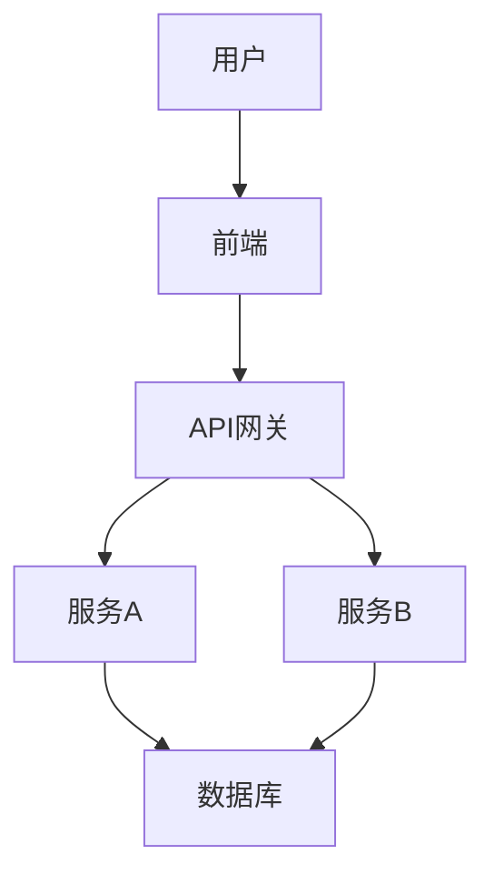
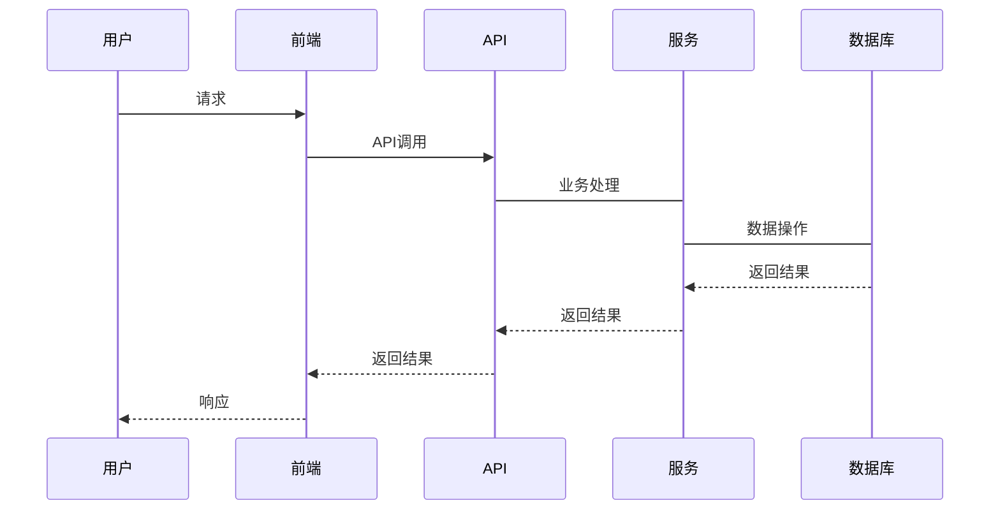

# {文档标题}

## 📖 概述

### 背景
<!-- 描述技术背景和需求来源 -->

### 目标
<!-- 描述技术目标 -->

### 范围
<!-- 描述技术范围 -->

## 🏗️ 架构设计

### 系统架构
<!-- 描述系统整体架构 -->



### 模块设计
<!-- 描述模块设计 -->

| 模块 | 职责 | 技术栈 |
|------|------|--------|
| 模块1 | 职责1 | 技术栈1 |
| 模块2 | 职责2 | 技术栈2 |

### 数据流
<!-- 描述数据流 -->



## 🔧 技术实现

### 技术选型
<!-- 描述技术选型 -->

| 技术 | 用途 | 版本 |
|------|------|------|
| 技术1 | 用途1 | 版本1 |
| 技术2 | 用途2 | 版本2 |

### 核心算法
<!-- 描述核心算法 -->

```java
// 算法示例
public class Algorithm {
    public void process() {
        // 算法实现
    }
}
```

### 关键代码
<!-- 描述关键代码 -->

```java
// 关键代码示例
@Service
public class Service {
    @Autowired
    private Repository repository;
    
    public Result process(Request request) {
        // 业务逻辑
    }
}
```

## 📊 性能设计

### 性能指标
<!-- 描述性能指标 -->

| 指标 | 目标值 | 当前值 |
|------|--------|--------|
| 响应时间 | <100ms | 80ms |
| 并发数 | >1000 | 1200 |
| 吞吐量 | >1000 TPS | 1200 TPS |

### 优化策略
<!-- 描述优化策略 -->

1. 缓存策略
2. 数据库优化
3. 代码优化
4. 架构优化

## 🔒 安全设计

### 安全策略
<!-- 描述安全策略 -->

1. 身份认证
2. 权限控制
3. 数据加密
4. 日志审计

### 权限控制
<!-- 描述权限控制 -->

| 角色 | 权限 | 说明 |
|------|------|------|
| 管理员 | 所有权限 | 系统管理 |
| 普通用户 | 部分权限 | 日常使用 |

## 📈 监控告警

### 监控指标
<!-- 描述监控指标 -->

1. 系统指标
2. 业务指标
3. 性能指标

### 告警规则
<!-- 描述告警规则 -->

| 指标 | 阈值 | 告警级别 |
|------|------|---------|
| CPU使用率 | >80% | 警告 |
| 内存使用率 | >90% | 严重 |

## 📝 附录

### 参考文档
<!-- 列出参考文档 -->

- [参考文档1](链接)
- [参考文档2](链接)

### 相关资源
<!-- 列出相关资源 -->

- [相关资源1](链接)
- [相关资源2](链接)

### 变更记录
<!-- 记录文档变更 -->

| 版本 | 日期 | 变更内容 | 作者 |
|------|------|---------|------|
| v1.0.0 | 日期 | 初始版本 | 作者 |
